<div align="center">


# Agentic Teams Workspace

Cinatra is an extensible Web application where people, AI assistants, and agents work together in projects, teams, and organizations, or across the whole workspace and in personal spaces. It provides the shared tools and knowledge to work together from discussion to delivery in a multi-purpose AI productivity environment that you can host yourself. Most notably, Cinatra supports an agent lifecycle, from selecting context and skills to scheduling, execution, review, and learning.

[**Overview**](#overview) · [**Agents**](#agents) · [**Assistants**](#assistants) · [**Connectors**](#connectors) · [**Skills**](#skills) · [**Artifacts**](#artifacts) · [**Extensions**](#extensions) · [**Permissions**](#permissions) · [**Integration**](#integration) · [**Architecture**](#architecture)

[**Quick start**](#quick-start) · [**Documentation**](#documentation) · [**Contributing**](#contributing)

[](LICENSE)
[](https://github.com/cinatra-ai/cinatra/releases)
[](https://github.com/cinatra-ai/cinatra/milestones)
[](https://github.com/cinatra-ai/cinatra/actions/workflows/build-image.yml)

</div>

<a href="https://www.youtube.com/watch?v=rWQMaZox95o">
  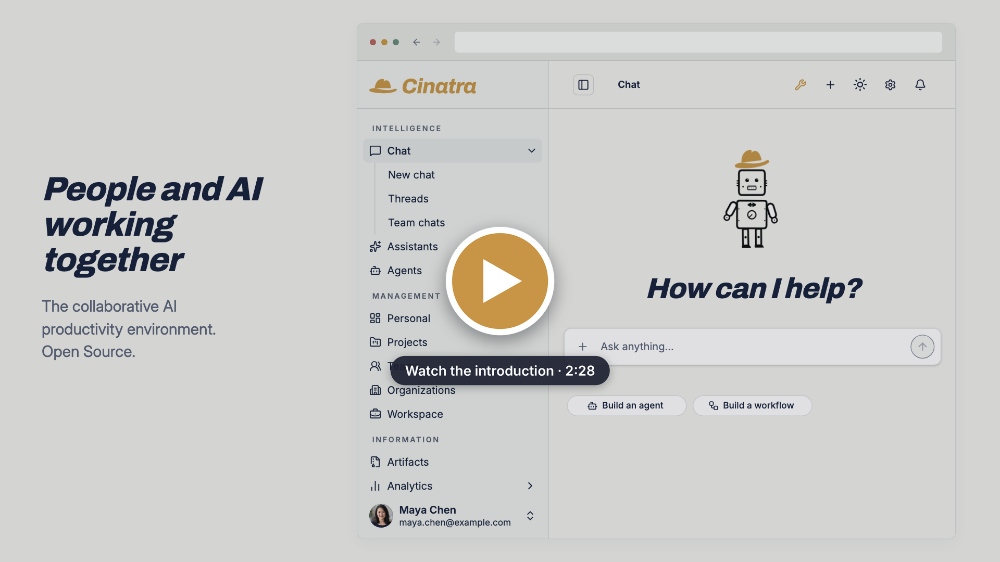
</a>

---

## Overview

- **Collaborate:** Bring people and their AI together in projects, teams, or organizations, such as headquarters, subsidiaries, or departments. Collaborate across the whole workspace, encompassing all these scopes, or work with your AI in a personal space.
- **Research:** Ask AI assistants to find, combine, and summarize information from connected applications and data stored in Cinatra, within your permissions.
- **Execute:** Run agents that plan, coordinate, and carry out work using connected applications. Agents can work together and pause for human input. Connect external agents through the Agent-to-Agent (A2A) protocol.
- **Automate:** Start work on demand, schedule it for later, or run it repeatedly. Background execution and persistent run state let work continue when you leave the page or close your laptop, with notifications when your attention is needed.
- **Connect:** Give assistants and agents access to applications through connectors that utilize APIs and Model Context Protocol (MCP) integrations. Let compatible external AI clients and coding agents use Cinatra’s exposed capabilities through its MCP server.
- **Customize:** Install extensions from the Cinatra marketplace or build your own agents, assistants, connectors, skills, and artifact types. Use conversational authoring in the Cinatra chat, or develop extensions in code.
- **Create:** Keep work as persistent artifacts (such as documents, drafts, images, and structured data) that people can inspect, edit, and review.
- **Reuse:** Compose more complex agents from existing agents, build new skills on top of existing ones, and use artifacts as context for subsequent work.
- **Share:** Share access to assistants, agents, skills, data, and artifacts within the workspace. Publish reusable extensions through the marketplace and connect agents across Cinatra instances.
- **Control:** Decide who can access resources, run agents, manage configuration, and approve work. Use review checkpoints to inspect outputs and request changes before configured publishing or handoff steps proceed. Track revisions and decisions through the relevant AI lifecycles.
- **Learn:** Turn feedback into reusable instructions. When enabled, Cinatra can distill captured review prompts into custom skills for future runs. Agents can also save and recall persistent memory, with controlled sharing of knowledge across users, teams, and organizations.
- **Embed:** Bring supported Cinatra capabilities into other applications through MCP integrations and embedded assistant interfaces. For example, ask Cinatra to update a page directly from your CMS, or request a report on last quarter’s conversion rates from within your CRM.

---

## Agents

Assistants provide the conversation interface through which people can start agents, guide their work, and review the results. Agents carry out that work through lifecycle steps connecting preparation, execution, human input, and reusable results. The steps that apply depend on the agent, the task, and workspace policies.

Each run keeps its state, outputs, and decisions so people can follow progress and return to the work later. Co-owners have the owner’s full rights to the run, allowing colleagues to manage it together.

<table>
  <tr>
    <td width="600" valign="top">
      <a href="assets/images/lifecycle/context.png">
        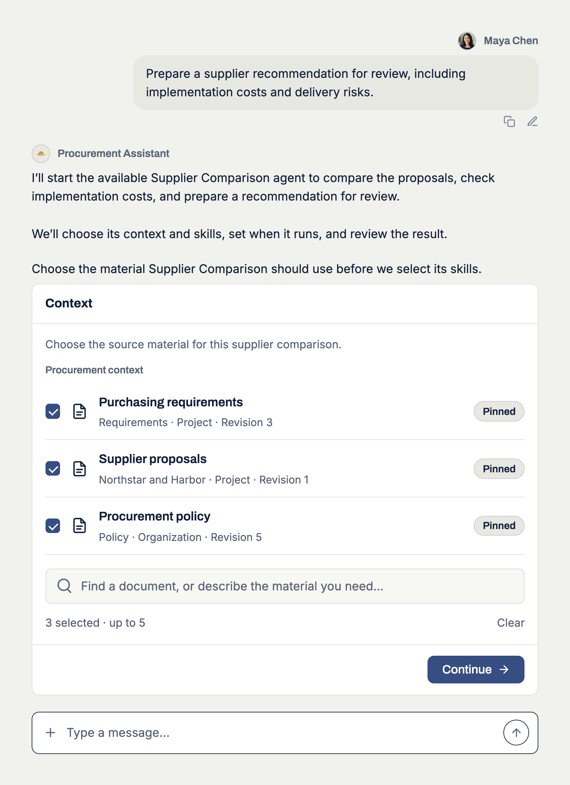
      </a>
    </td>
    <td valign="top">
      <h3>Context</h3>
      <p>Choose the material the agent should work from, such as a strategy, customer profile, or brand guidelines. The Context step comes before Skills and helps you find artifacts or import documents through supported connectors. You decide what to include, and the selected revisions remain fixed for the run.</p>
      <p><a href="assets/images/lifecycle/context.png">View screenshot</a></p>
    </td>
  </tr>
  <tr>
    <td width="600" valign="top">
      <a href="assets/images/lifecycle/skills.png">
        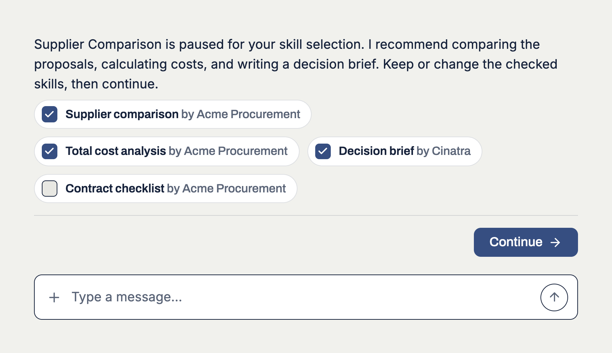
      </a>
    </td>
    <td valign="top">
      <h3>Skills</h3>
      <p>Equip the agent with reusable instructions in the open <a href="https://agentskills.io/">Agent Skills</a> format, centered on <code>SKILL.md</code> files. Skills are reusable Cinatra extensions. Review recommended skills alongside those assigned within the applicable personal, project, team, organization, or workspace scope.</p>
      <p><a href="assets/images/lifecycle/skills.png">View screenshot</a></p>
    </td>
  </tr>
  <tr>
    <td width="600" valign="top">
      <a href="assets/images/lifecycle/scheduling.png">
        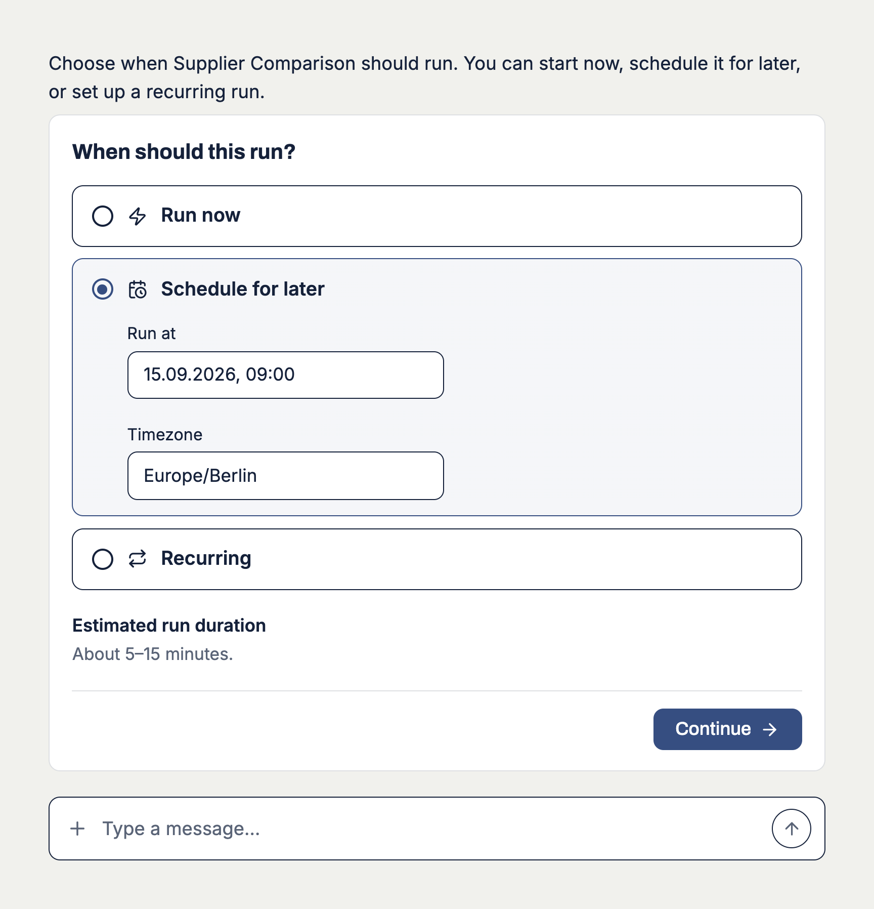
      </a>
    </td>
    <td valign="top">
      <h3>Scheduling</h3>
      <p>Start work immediately, schedule it for later, or configure recurring runs. Review the proposed schedule before confirming it and manage future execution through the scheduling controls.</p>
      <p><a href="assets/images/lifecycle/scheduling.png">View screenshot</a></p>
    </td>
  </tr>
  <tr>
    <td width="600" valign="top">
      <a href="assets/images/lifecycle/execution.png">
        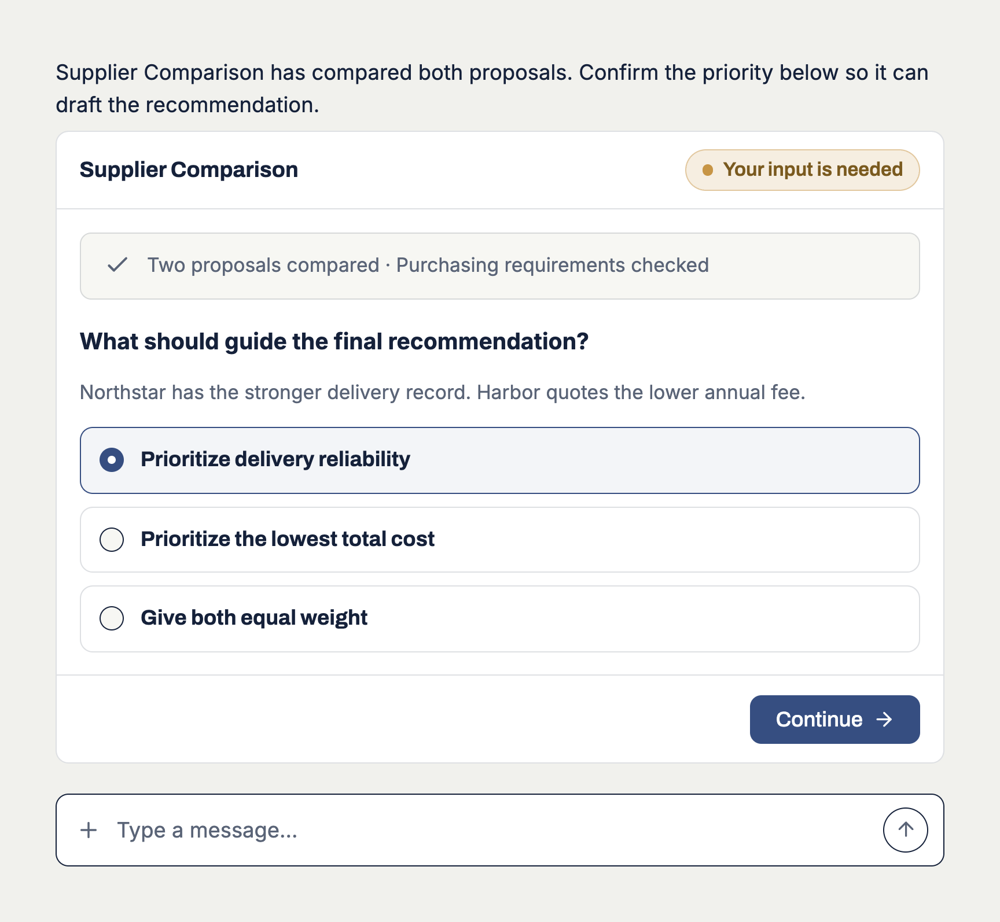
      </a>
    </td>
    <td valign="top">
      <h3>Execution</h3>
      <p>The agent carries out its work using the selected context, skills, and connected applications. It can coordinate with other agents and pause to request information or a decision. Background execution preserves progress while you are away.</p>
      <p><a href="assets/images/lifecycle/execution.png">View screenshot</a></p>
    </td>
  </tr>
  <tr>
    <td width="600" valign="top">
      <a href="assets/images/lifecycle/review.png">
        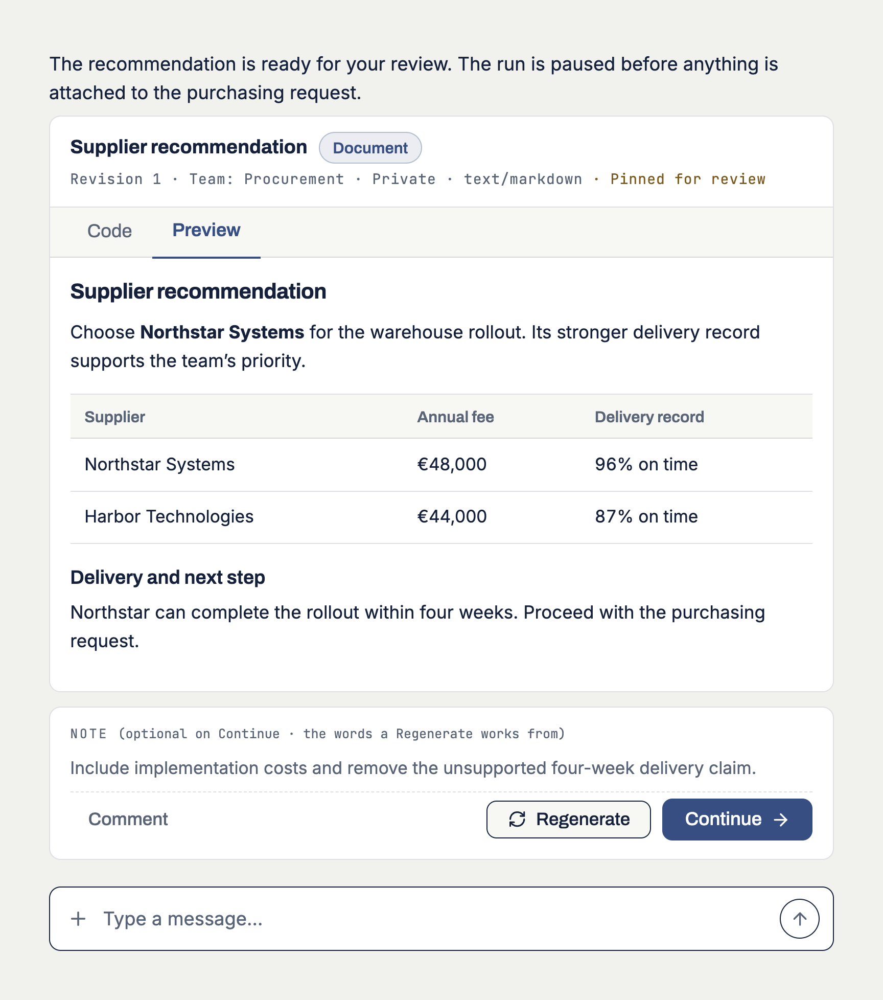
      </a>
    </td>
    <td valign="top">
      <h3>Review</h3>
      <p>Inspect the work, provide feedback, request changes, or let the run continue. Reviews can happen between execution steps, including before publishing or handing work to another agent. The change workflow returns requests to the producing agent and brings back a new revision of the same artifact for you to check.</p>
      <p><a href="assets/images/lifecycle/review.png">View screenshot</a></p>
    </td>
  </tr>
  <tr>
    <td width="600" valign="top">
      <a href="assets/images/lifecycle/auditing.png">
        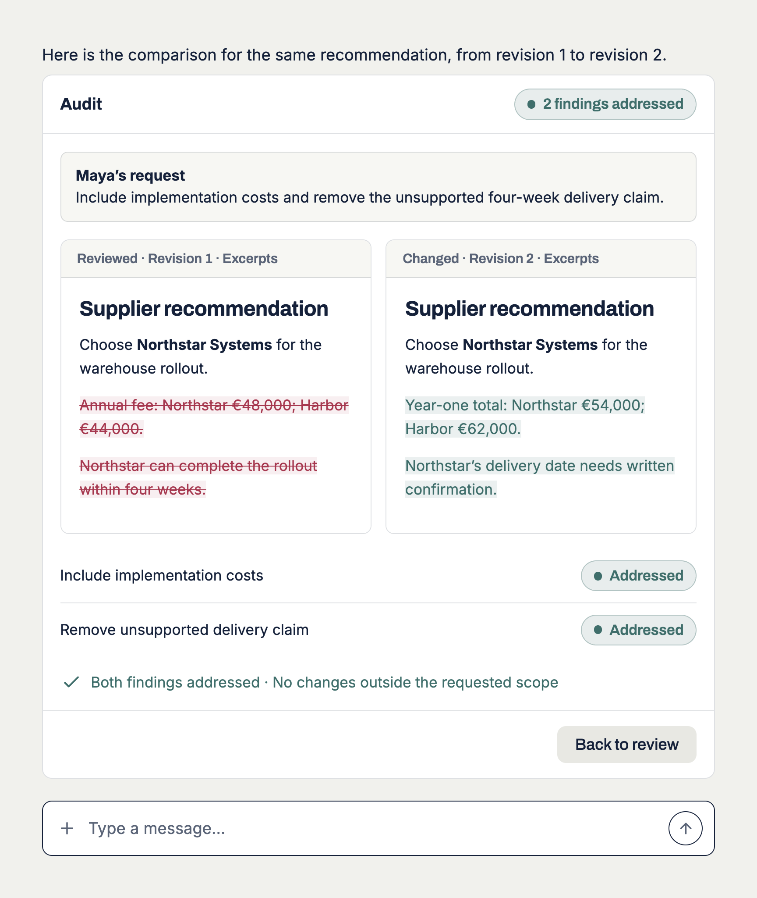
      </a>
    </td>
    <td valign="top">
      <h3>Auditing</h3>
      <p>Examine the record behind a requested change. The Audit view opens from Review and shows the reviewed and changed revisions side by side, together with the request, the outcome of each finding, and verification evidence. It is available on demand after changes have been requested and does not add a mandatory stop.</p>
      <p><a href="assets/images/lifecycle/auditing.png">View screenshot</a></p>
    </td>
  </tr>
  <tr>
    <td width="600" valign="top">
      <a href="assets/images/lifecycle/artifacts.png">
        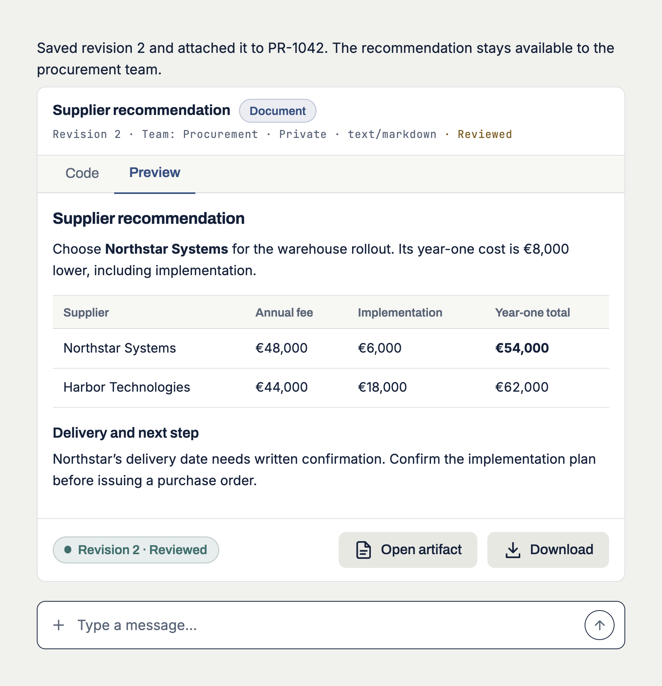
      </a>
    </td>
    <td valign="top">
      <h3>Artifacts</h3>
      <p>Keep the resulting artifacts, their revisions, and associated decisions for later inspection and reuse. Supported publishing and handoff steps deliver work to connected applications or downstream agents.</p>
      <p><a href="assets/images/lifecycle/artifacts.png">View screenshot</a></p>
    </td>
  </tr>
  <tr>
    <td width="600" valign="top">
      <a href="assets/images/lifecycle/learning.png">
        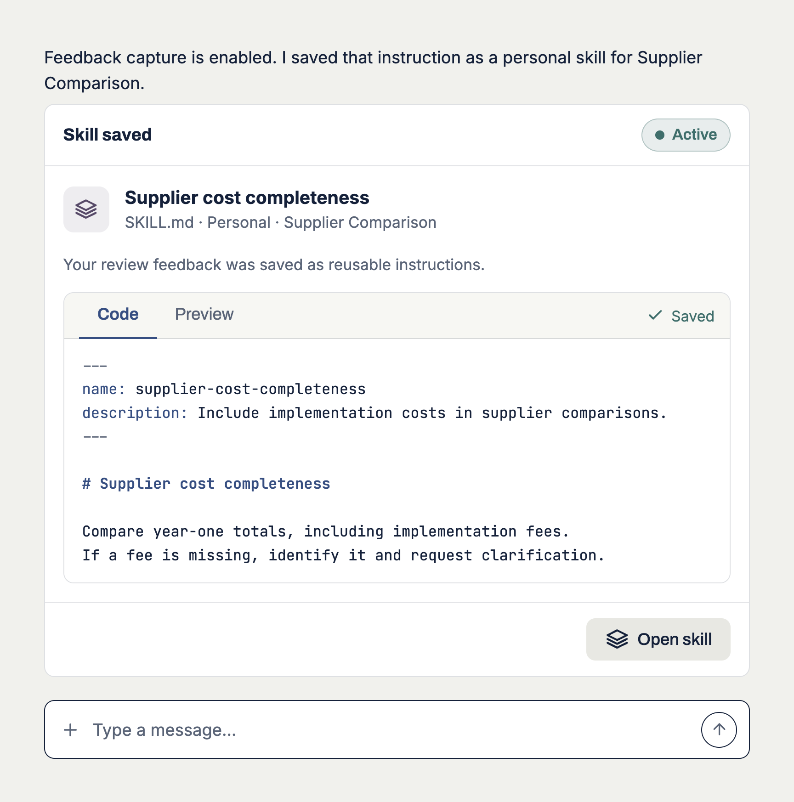
      </a>
    </td>
    <td valign="top">
      <h3>Learning</h3>
      <p>Carry useful feedback into future runs through <a href="#skills">Skills</a>. Agents can also save and recall persistent memory to reuse knowledge and solutions.</p>
      <p><a href="assets/images/lifecycle/learning.png">View screenshot</a></p>
    </td>
  </tr>
  <tr>
    <td width="600" valign="top">
      <a href="assets/images/lifecycle/notifications.png">
        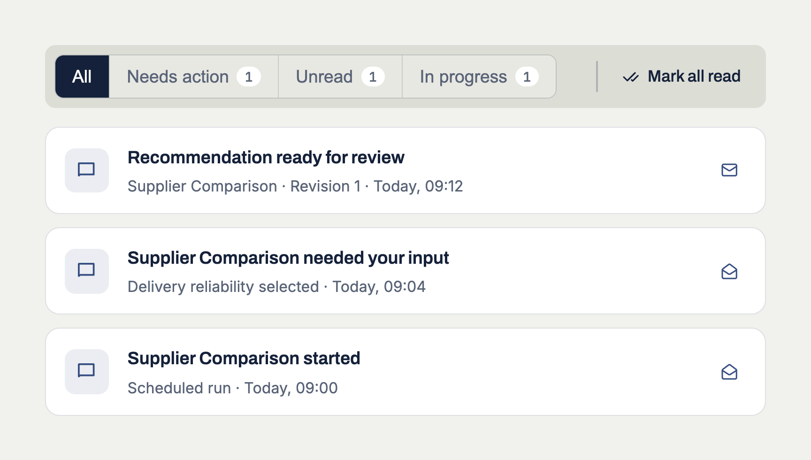
      </a>
    </td>
    <td valign="top">
      <h3>Notifications</h3>
      <p>Stay informed when a lifecycle step needs your attention, such as a request for input or an artifact awaiting review. Notifications link back to the relevant run so you can inspect its state and act. A persistent notification feed keeps these requests accessible when you return to the workspace.</p>
      <p><a href="assets/images/lifecycle/notifications.png">View screenshot</a></p>
    </td>
  </tr>
</table>

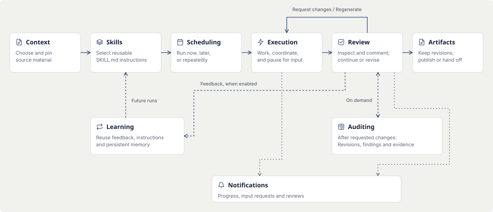

## Assistants

Assistants bring people and AI together in conversation. Use them to research, develop ideas, work with connected applications, and guide agents through their lifecycle. Each assistant can specialize in a particular application or knowledge domain, or represent an LLM or AI system such as Claude, Codex, or Gemini, bringing its expertise, capabilities, and tools into the conversation.

<table>
  <tr>
    <td width="600" valign="top">
      <a href="assets/images/overview/assistants-full.png">
        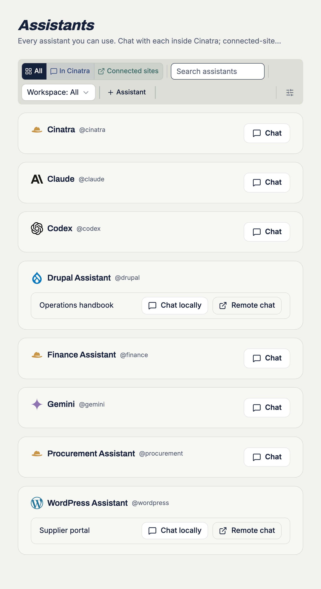
      </a>
    </td>
    <td valign="top">
      <h3>Selection</h3>
      <p>Open an assistant from the directory or the scope where you are working. Assistants can serve different domains, use different model providers, or connect to a particular application or site.</p>
      <p><a href="assets/images/overview/assistants-full.png">View screenshot</a></p>
    </td>
  </tr>
  <tr>
    <td width="600" valign="top">
      <a href="assets/images/features/assistants-chat.png">
        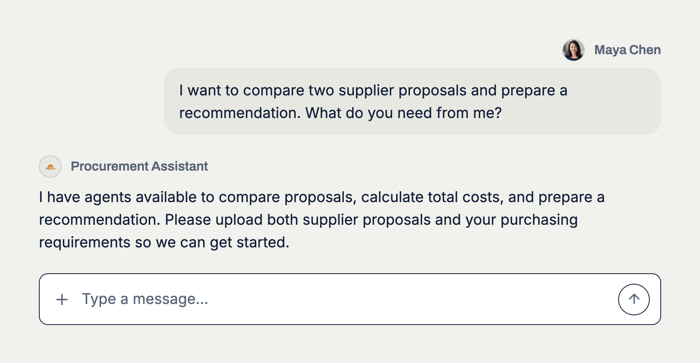
      </a>
    </td>
    <td valign="top">
      <h3>Chat</h3>
      <p>Discuss a task with an assistant, ask follow-up questions, and refine the work together. Bring relevant information into the conversation to compare options, develop ideas, and decide what to do next.</p>
      <p><a href="assets/images/features/assistants-chat.png">View screenshot</a></p>
    </td>
  </tr>
  <tr>
    <td width="600" valign="top">
      <a href="assets/images/features/assistants-collaboration.png">
        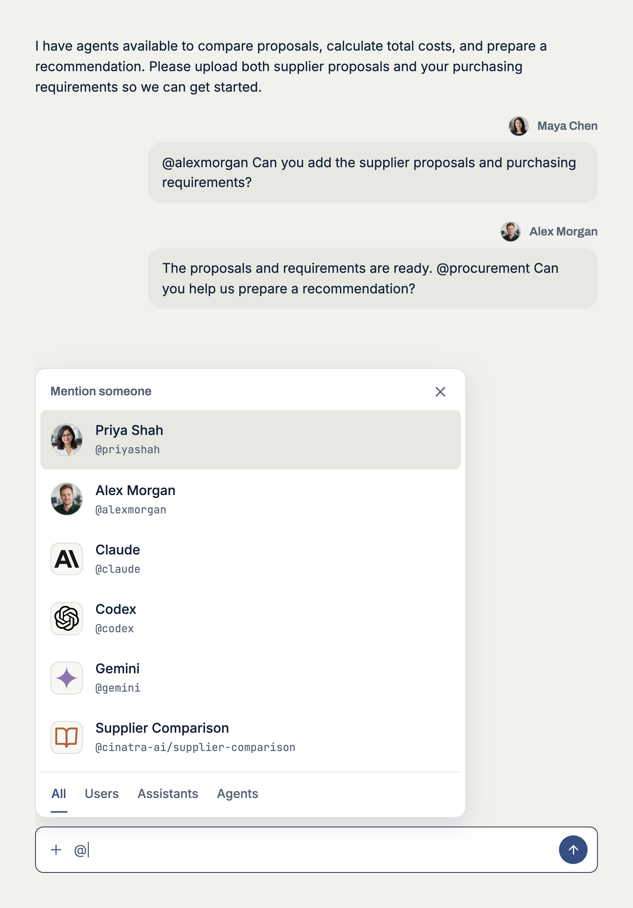
      </a>
    </td>
    <td valign="top">
      <h3>Collaboration</h3>
      <p>Bring teammates and AI into the same conversation. Use the <code>@</code> menu to find people, assistants, and agents by name, then mention them to involve colleagues, get an assistant’s input, or start an agent. Each contribution is attributed to its author.</p>
      <p><a href="assets/images/features/assistants-collaboration.png">View screenshot</a></p>
    </td>
  </tr>
  <tr>
    <td width="600" valign="top">
      <a href="assets/images/features/assistants-embedded.png">
        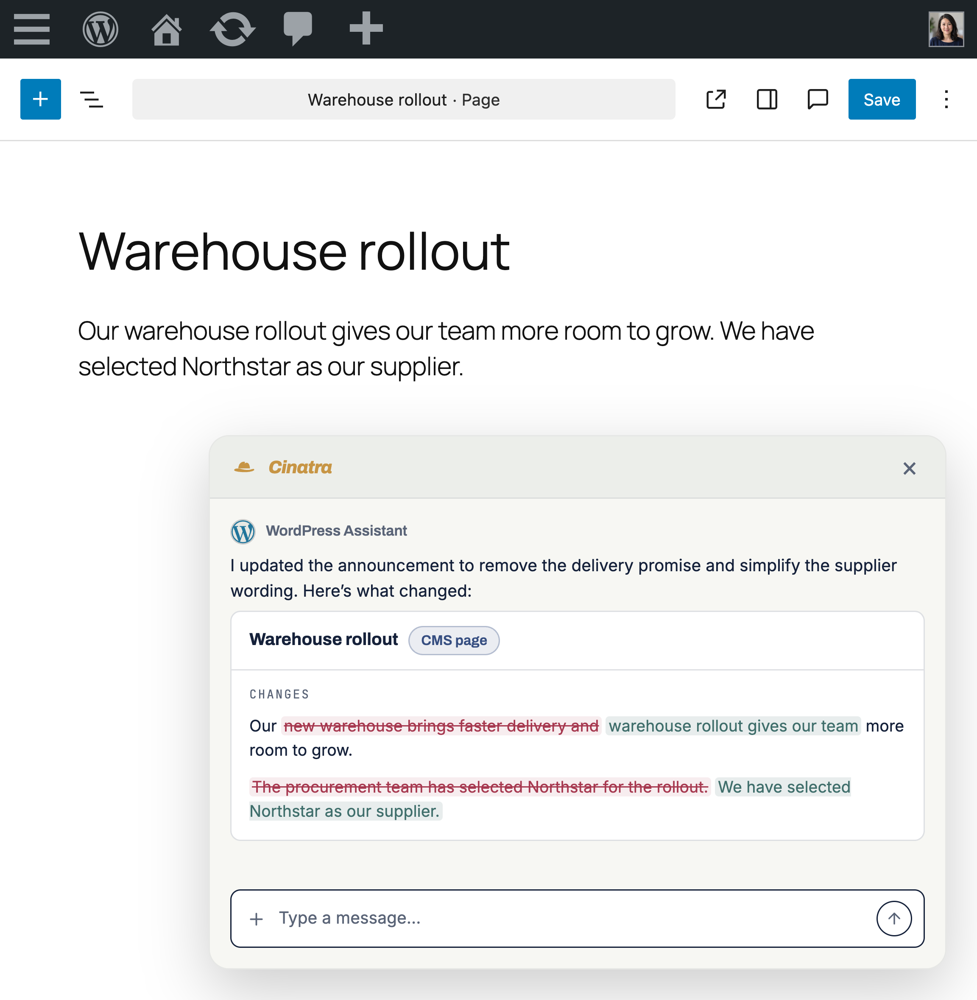
      </a>
    </td>
    <td valign="top">
      <h3>Embedded assistants</h3>
      <p>Work with an assistant inside a connected application (e.g. a CMS such as WordPress). An embedded interface streams the conversation into the application, so you can ask for help with the content you are working on.</p>
      <p><a href="assets/images/features/assistants-embedded.png">View screenshot</a></p>
    </td>
  </tr>
  <tr>
    <td width="600" valign="top">
      <a href="assets/images/features/assistants-configuration.png">
        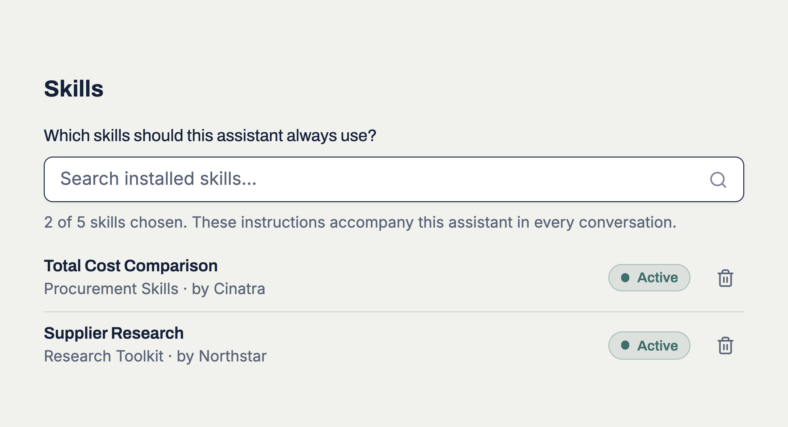
      </a>
    </td>
    <td valign="top">
      <h3>Configuration</h3>
      <p>Shape an assistant’s role through its instructions, skills, model preferences, and permitted tools and agents. Control who can use it through its configured audience and access permissions.</p>
      <p><a href="assets/images/features/assistants-configuration.png">View screenshot</a></p>
    </td>
  </tr>
</table>

- **Conversation history:** Return to saved conversations and their work later, with the context of earlier requests and replies.
- **Human decisions:** An assistant can present a review and recommend an outcome. Approval, scheduling, and cancellation require a signed-in user’s own session and permissions. The assistant cannot perform those actions independently, and this restriction cannot be disabled by configuration.

## Connectors

Connectors give assistants and agents access to the applications and services your work depends on, from CRM and CMS platforms to email, calendars, and external AI tools. A connector is an extension that supplies the integration; a connection links it to a particular account, site, or service. Integrations can use application APIs, the Model Context Protocol (MCP), and other supported interfaces.

<table>
  <tr>
    <td width="600" valign="top">
      <a href="assets/images/overview/connectors-full.png">
        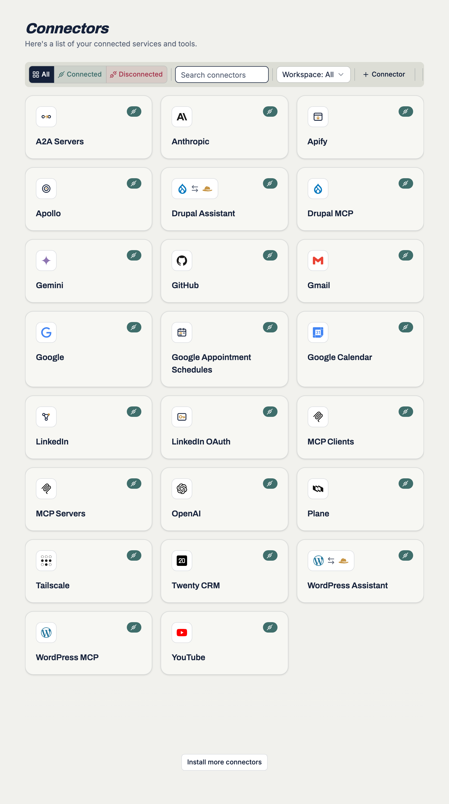
      </a>
    </td>
    <td valign="top">
      <h3>Directory</h3>
      <p>Browse available connectors, search by name, and filter by connection status and scope. Open a connector to see the accounts or sites available to you.</p>
      <p><a href="assets/images/overview/connectors-full.png">View screenshot</a></p>
    </td>
  </tr>
  <tr>
    <td width="600" valign="top">
      <a href="assets/images/features/connectors-connections.png">
        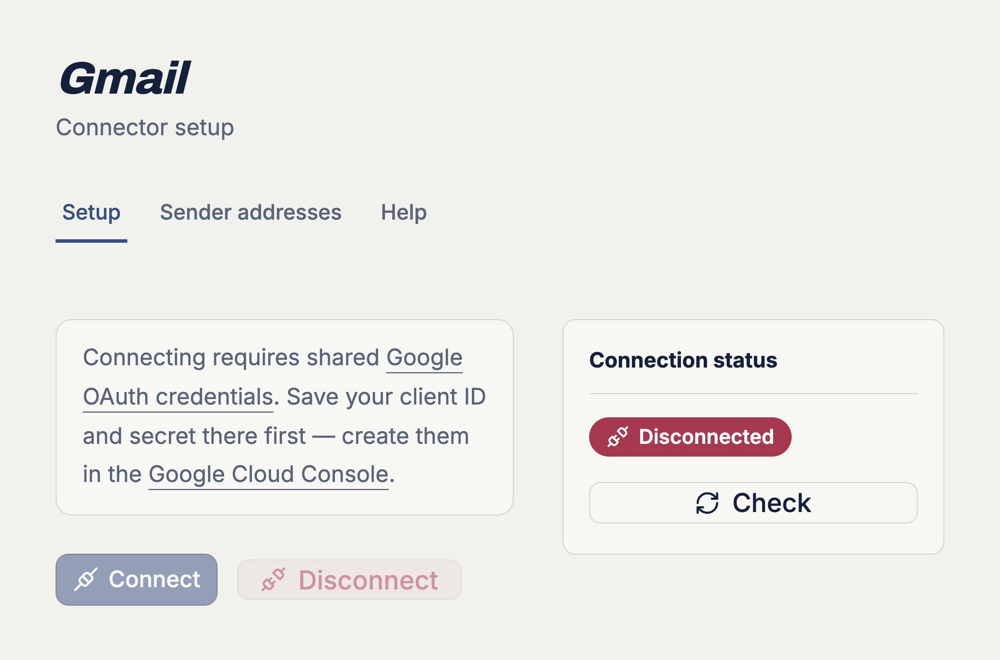
      </a>
    </td>
    <td valign="top">
      <h3>Setup</h3>
      <p>Authorize an account or supply the credentials the integration requires. Connect multiple accounts or sites where supported, and manage their settings and connection status.</p>
      <p><a href="assets/images/features/connectors-connections.png">View screenshot</a></p>
    </td>
  </tr>
  <tr>
    <td width="600" valign="top">
      <a href="assets/images/features/connectors-sharing.png">
        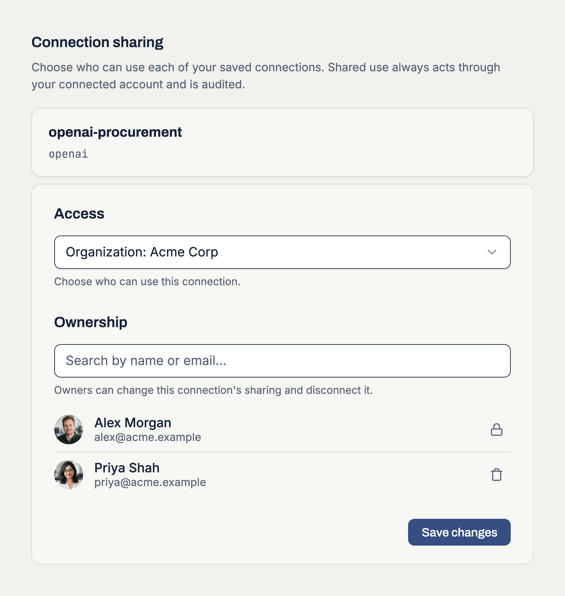
      </a>
    </td>
    <td valign="top">
      <h3>Sharing</h3>
      <p>Keep a connection personal or share it with selected people and scopes, within the connector’s sharing rules. Manage access and co-owners for each connection so collaborators and their AI can use the appropriate accounts.</p>
      <p><a href="assets/images/features/connectors-sharing.png">View screenshot</a></p>
    </td>
  </tr>
</table>

- **Information retrieval:** Let assistants retrieve and combine information from connected applications within your permissions. Use supported records and imported documents as context for an agent’s work.
- **Application actions:** Give agents the tools to act in connected applications, such as updating CRM records, preparing email, or publishing reviewed content. Available actions depend on the connector and the permissions granted to the connection.

## Skills

Skills give assistants and agents reusable instructions for how to work, such as applying a brand voice, evaluating suppliers, or following a research method. They are Cinatra extensions built around a `SKILL.md` file in the open [Agent Skills](https://agentskills.io/) format, with supporting resources where needed.

<table>
  <tr>
    <td width="600" valign="top">
      <a href="assets/images/overview/skills-full.png">
        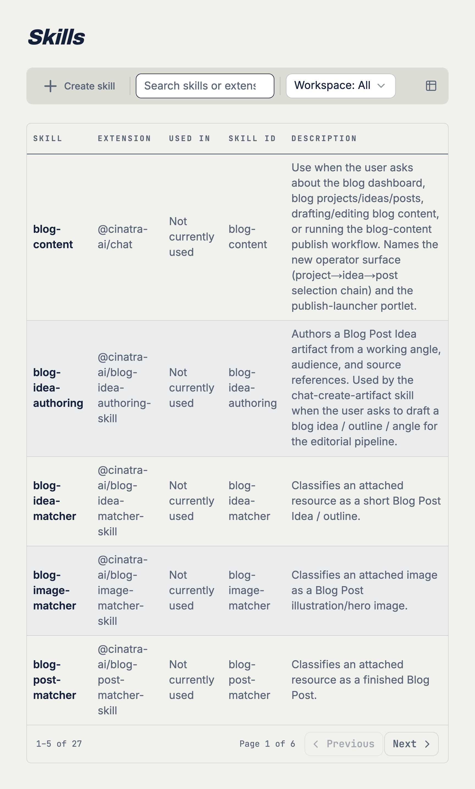
      </a>
    </td>
    <td valign="top">
      <h3>Catalog</h3>
      <p>Browse the skills available in your workspace and see their instructions, source extensions, and the assistants or agents that use them. Search the catalog and filter by scope to find relevant guidance.</p>
      <p><a href="assets/images/overview/skills-full.png">View screenshot</a></p>
    </td>
  </tr>
  <tr>
    <td width="600" valign="top">
      <a href="assets/images/features/skills-assignments.png">
        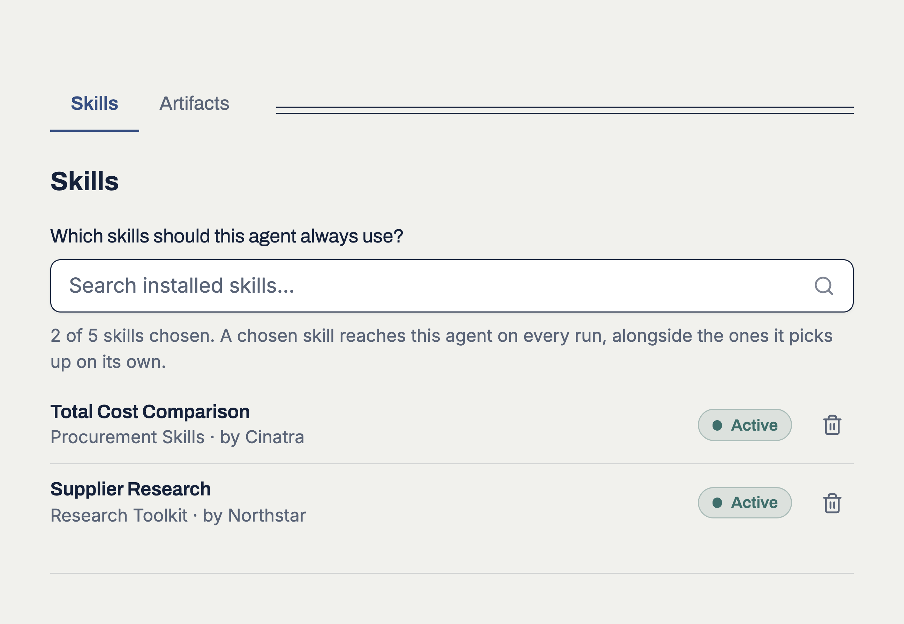
      </a>
    </td>
    <td valign="top">
      <h3>Assignments</h3>
      <p>Configure skills for an agent or assistant within a personal, project, team, organization, or workspace scope. Assignments follow the applicable scope permissions, so shared instructions can reflect how each group works.</p>
      <p><a href="assets/images/features/skills-assignments.png">View screenshot</a></p>
    </td>
  </tr>
</table>

- **Learning:** When enabled, Cinatra can distill durable instructions from captured conversations and review feedback into personal skills for future runs. Share useful guidance within a project, team, organization, or workspace so individual corrections become shared knowledge.
- **Revision history:** Keep a history of skill revisions, inspect changes, and manage which skills remain active. Replace or retire outdated guidance while preserving the record of how it evolved.

## Artifacts

Artifacts make work available beyond the conversation or run that produced it. They can be source material, intermediate drafts, or finished deliverables, bringing the inputs and results of human and AI collaboration into a shared library.

Cinatra supports MIME-type artifacts, which identify file formats such as PDF, images, or Markdown, and meaning-type artifacts, which identify what the content represents, such as brand guidelines, a customer profile, or a strategy. Meaning types help agents find relevant context regardless of the underlying file format.

<table>
  <tr>
    <td width="600" valign="top">
      <a href="assets/images/overview/artifacts-full.png">
        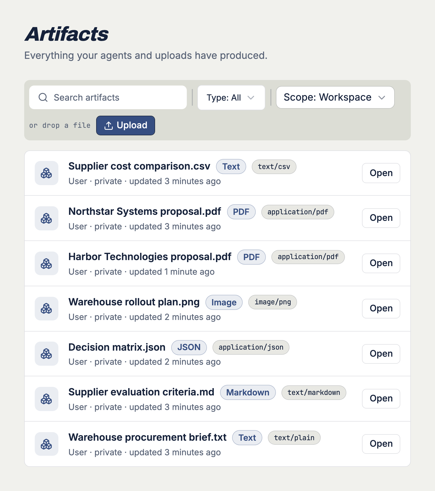
      </a>
    </td>
    <td valign="top">
      <h3>Discovery</h3>
      <p>Browse artifacts within the scopes you can access. Ownership, sharing permissions, and project context determine which material is available to you and to the agents working with you.</p>
      <p><a href="assets/images/overview/artifacts-full.png">View screenshot</a></p>
    </td>
  </tr>
  <tr>
    <td width="600" valign="top">
      <a href="assets/images/features/artifacts-review.png">
        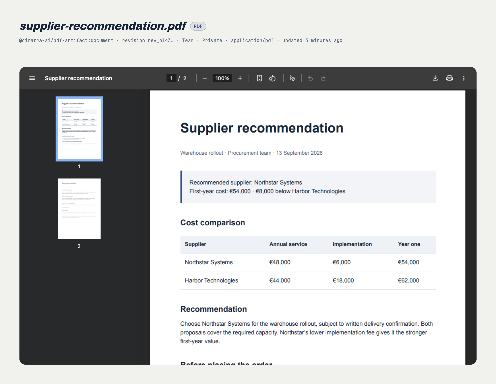
      </a>
    </td>
    <td valign="top">
      <h3>Review</h3>
      <p>Inspect the artifact at full size through its type’s renderer, request changes from its producing agent, or edit it in place through the available editor. The review workflow applies across artifact types.</p>
      <p><a href="assets/images/features/artifacts-review.png">View screenshot</a></p>
    </td>
  </tr>
  <tr>
    <td width="600" valign="top">
      <a href="assets/images/features/artifacts-history.png">
        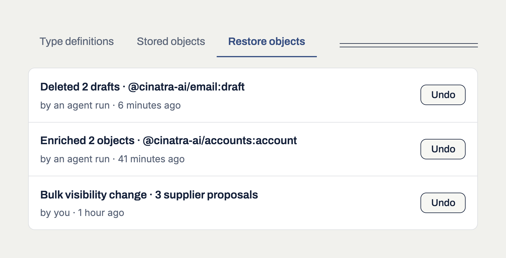
      </a>
    </td>
    <td valign="top">
      <h3>Version history</h3>
      <p>Retain revisions and review decisions within the scope that owns the artifact. Modified data records carry a change history, and most changes can be reverted in one step while preserving that history.</p>
      <p><a href="assets/images/features/artifacts-history.png">View screenshot</a></p>
    </td>
  </tr>
  <tr>
    <td width="600" valign="top">
      <a href="assets/images/features/artifacts-records.png">
        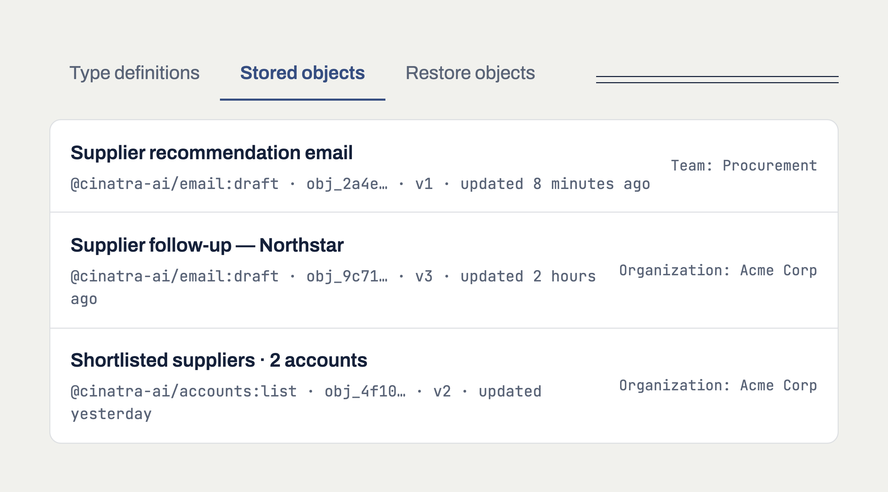
      </a>
    </td>
    <td valign="top">
      <h3>Records and lists</h3>
      <p>Work with typed records such as contacts, accounts, campaigns, content, and media. Lists group records into reusable inputs and outputs for agents.</p>
      <p><a href="assets/images/features/artifacts-records.png">View screenshot</a></p>
    </td>
  </tr>
  <tr>
    <td width="600" valign="top">
      <a href="assets/images/features/artifacts-meaning.png">
        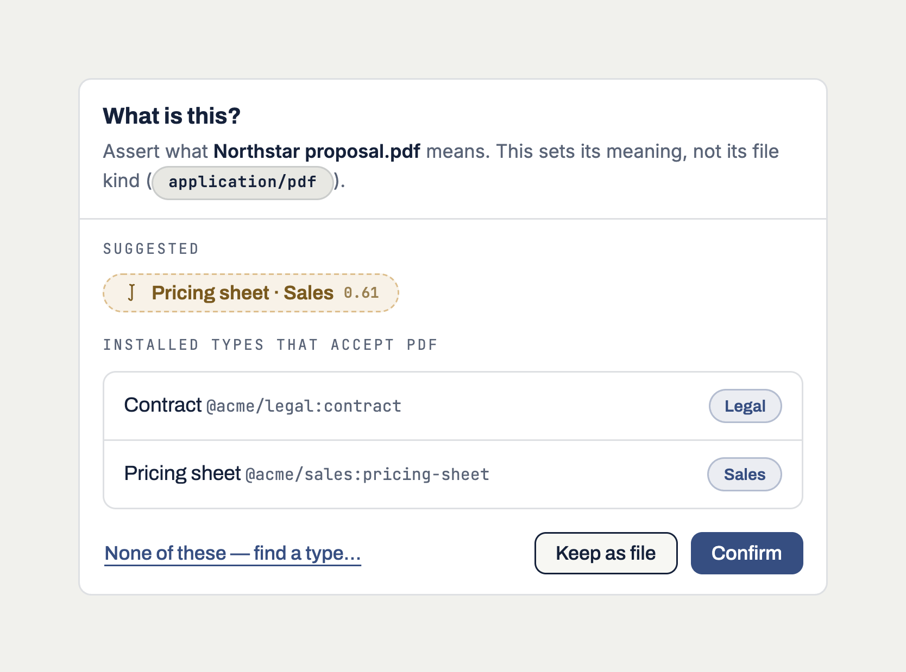
      </a>
    </td>
    <td valign="top">
      <h3>Meaning types</h3>
      <p>Choose what an uploaded file represents, such as a supplier contract or pricing sheet, while retaining its original file format. Confirm a suggested meaning or select a compatible type so people and agents can find and reuse the material.</p>
      <p><a href="assets/images/features/artifacts-meaning.png">View screenshot</a></p>
    </td>
  </tr>
  <tr>
    <td width="600" valign="top">
      <a href="assets/images/features/artifacts-context-assignments.png">
        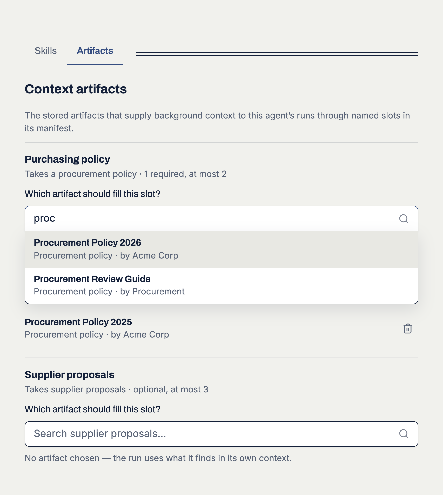
      </a>
    </td>
    <td valign="top">
      <h3>Context assignments</h3>
      <p>Give an agent reusable inputs through named context slots, such as purchasing policies or supplier proposals. Each slot accepts the artifact kinds and number of items the agent declares, with choices drawn from the relevant scope. Selected revisions stay fixed for each run, so later edits do not silently change its inputs.</p>
      <p><a href="assets/images/features/artifacts-context-assignments.png">View screenshot</a></p>
    </td>
  </tr>
  <tr>
    <td width="600" valign="top">
      <a href="assets/images/features/artifacts-dashboards.png">
        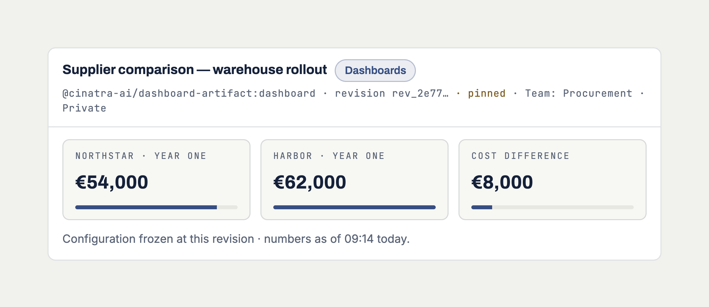
      </a>
    </td>
    <td valign="top">
      <h3>Dashboards</h3>
      <p>Arrange widgets by drag and drop or ask an assistant to build a dashboard on the shared semantic layer. Usage and cost analytics are included.</p>
      <p><a href="assets/images/features/artifacts-dashboards.png">View screenshot</a></p>
    </td>
  </tr>
  <tr>
    <td width="600" valign="top">
      <a href="assets/images/features/artifacts-dashboard-references.png">
        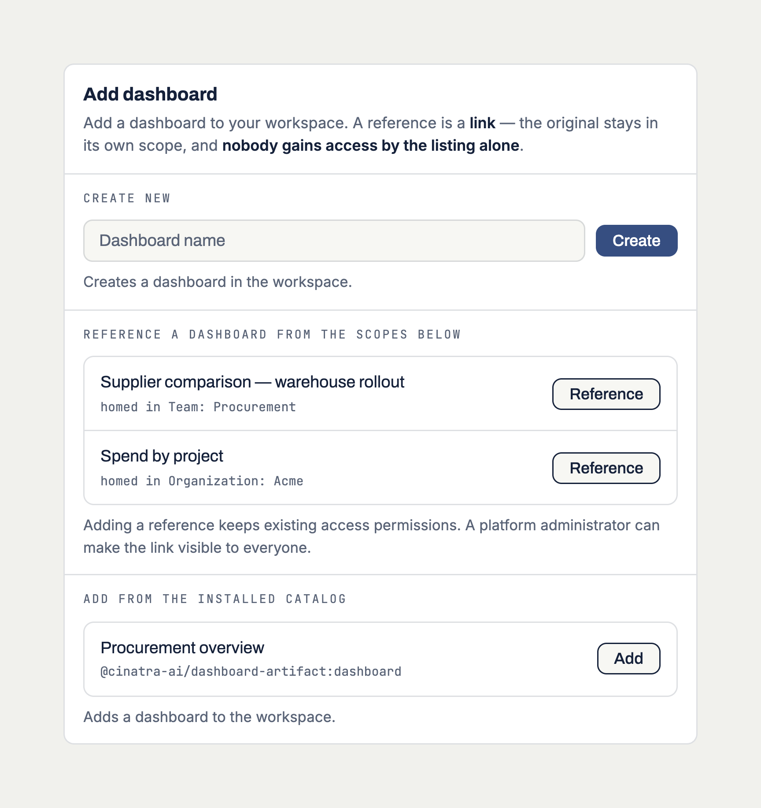
      </a>
    </td>
    <td valign="top">
      <h3>Dashboard references</h3>
      <p>Make an existing dashboard available from another project, team, organization, or the workspace through a reference. The dashboard keeps its original home and access rules; listing it elsewhere does not grant additional access.</p>
      <p><a href="assets/images/features/artifacts-dashboard-references.png">View screenshot</a></p>
    </td>
  </tr>
</table>

- **Collection:** Keep generated documents, emails, slide decks, images, charts, dashboards, PDFs, and structured data alongside uploads and connected records.
- **Publication:** Publish a chosen revision to a supported destination or pass it into subsequent work. Set approval rules by artifact type and destination; external actions are blocked unless the applicable checks pass. Scheduling governs delivery timing, and the publication record keeps the outcome attached to the artifact.

## Extensions

Extensions adapt Cinatra to the work your organization does. They supply agents and assistants, application connectors, reusable skills, and artifact types, so teams can combine shared capabilities with their own processes and expertise. Discover and install extensions from the Cinatra marketplace at [marketplace.cinatra.ai](https://marketplace.cinatra.ai).

<table>
  <tr>
    <td width="600" valign="top">
      <a href="assets/images/overview/marketplace-full.png">
        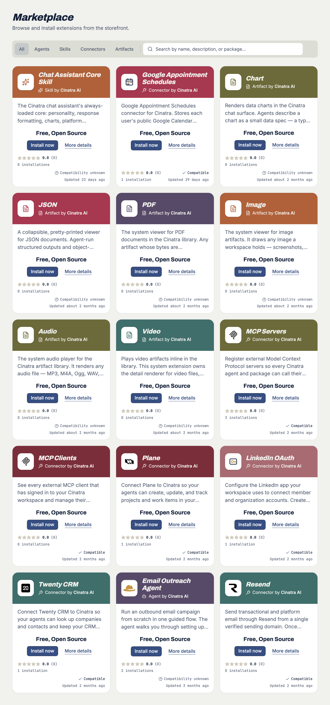
      </a>
    </td>
    <td valign="top">
      <h3>Marketplace</h3>
      <p>Browse marketplace listings to understand what an extension provides, who publishes it, and which versions are compatible with your Cinatra instance.</p>
      <p><a href="https://marketplace.cinatra.ai">Visit marketplace</a></p>
    </td>
  </tr>
  <tr>
    <td width="600" valign="top">
      <a href="assets/images/features/extensions-installation.png">
        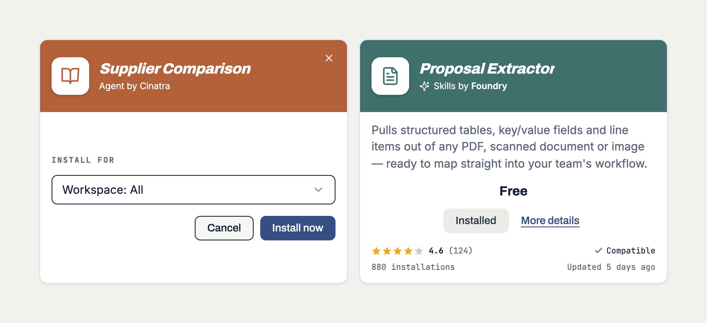
      </a>
    </td>
    <td valign="top">
      <h3>Installation</h3>
      <p>Add an extension from the marketplace, upload a ZIP package from another instance or your own development work, or install from a GitHub repository. Cinatra validates the package and applies the setup requirements for its kind.</p>
      <p><a href="assets/images/features/extensions-installation.png">View screenshot</a></p>
    </td>
  </tr>
  <tr>
    <td width="600" valign="top">
      <a href="assets/images/features/extensions-installation-requests.png">
        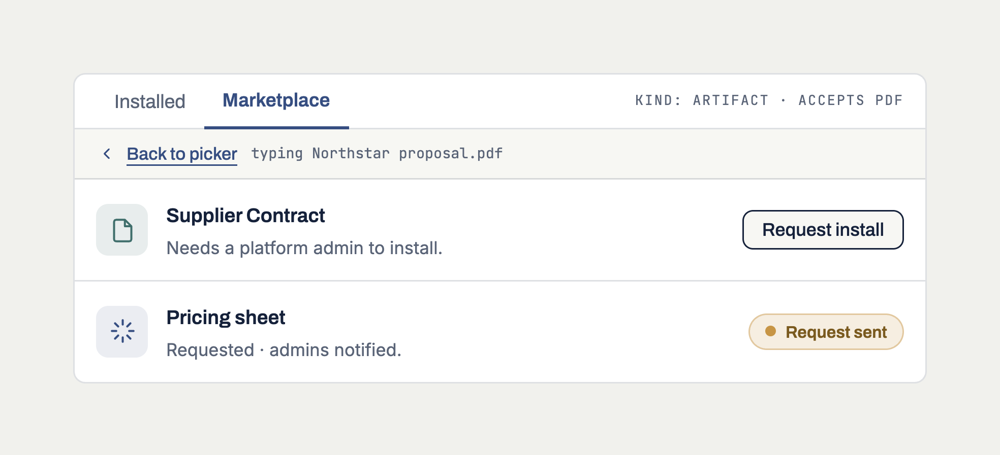
      </a>
    </td>
    <td valign="top">
      <h3>Installation requests</h3>
      <p>Request an artifact extension from the type picker when you cannot install it yourself. Cinatra notifies platform administrators with the package and requester details, and shows when the request has been sent.</p>
      <p><a href="assets/images/features/extensions-installation-requests.png">View screenshot</a></p>
    </td>
  </tr>
  <tr>
    <td width="600" valign="top">
      <a href="assets/images/features/extensions-management.png">
        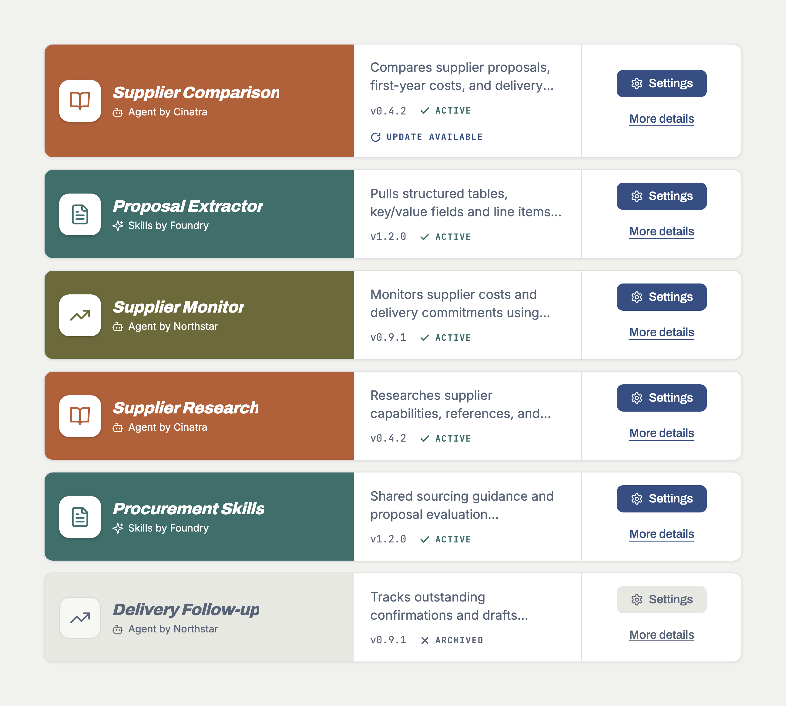
      </a>
    </td>
    <td valign="top">
      <h3>Installed extensions</h3>
      <p>Browse the extensions available in your instance, inspect their versions and active or archived status, and open their settings or package details from one place.</p>
      <p><a href="assets/images/features/extensions-management.png">View screenshot</a></p>
    </td>
  </tr>
  <tr>
    <td width="600" valign="top">
      <a href="assets/images/features/extensions-maintenance.png">
        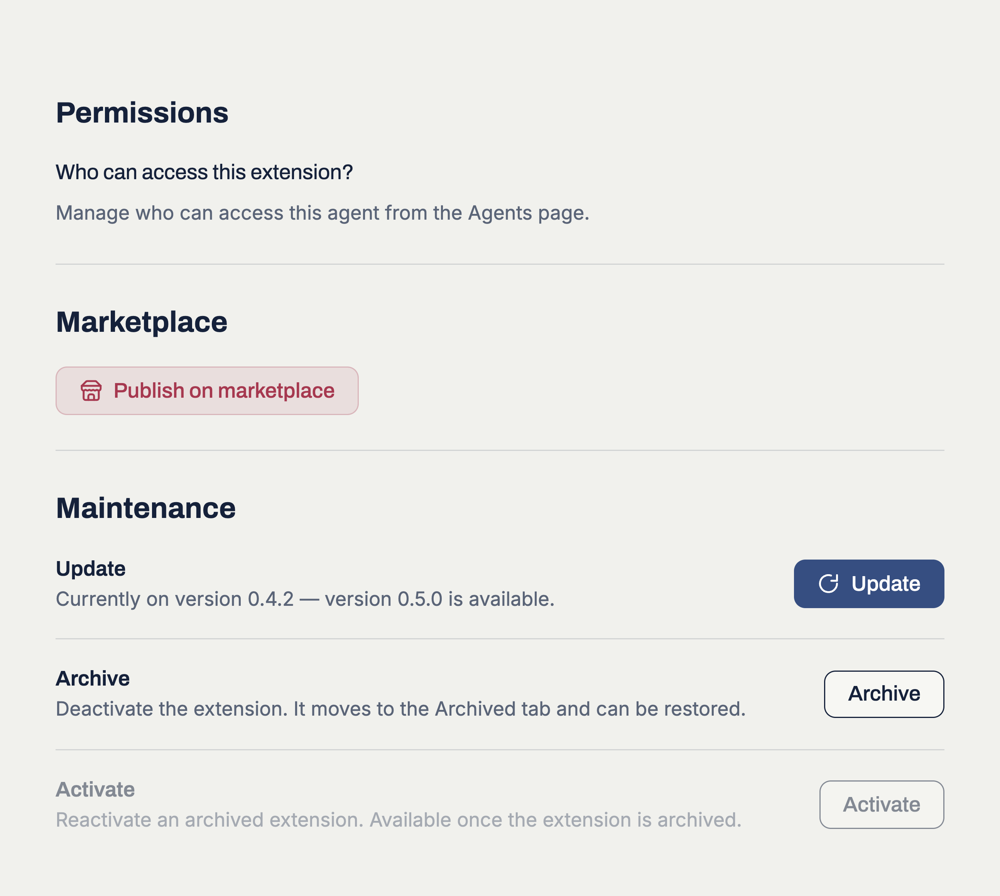
      </a>
    </td>
    <td valign="top">
      <h3>Lifecycle management</h3>
      <p>Manage extension versions and updates, and publish reusable packages privately or publicly for other Cinatra instances. Installation permissions, capability grants, and publishing reviews govern how extensions become available to others. Archive extensions you no longer need and reactivate them when required.</p>
      <p><a href="assets/images/features/extensions-maintenance.png">View screenshot</a></p>
    </td>
  </tr>
</table>

- **Configuration:** Choose the applicable installation scope, complete the required connections and settings, and control access to the capabilities it exposes. Each user’s access to connected accounts is governed by connection permissions.
- **Composition:** Build on installed extensions to connect applications, equip assistants and agents with skills, and produce new kinds of artifacts. Using the [Open Agent Specification (OAS)](https://oracle.github.io/agent-spec/26.1.2/howtoguides/index.html), combine agents into more complex agents and workflows through sequential pipelines, conditional routing, parallel execution, map-reduce, orchestrator-workers, manager-worker teams, and swarms with message passing or conversation handoffs. Author extensions conversationally with an assistant or develop them in code. Artifact extensions can provide their own renderers and editors.
- **Development tools:** Scaffold an extension with `cinatra create-extension`, which generates its manifest, package structure, documentation, and validation checks. Cinatra’s authoring skills guide AI coding agents through implementation, testing, and packaging, with specialized guidance for agents, connectors, artifact types, and skill bundles.
- **Portability:** Export agent extensions as ZIP archives and import them on another Cinatra instance. Connectors, skills, and artifact types can also be packaged as ZIP files for upload, with package validation and installation permissions applied on the receiving instance.
- **Authoring review:** Describe an agent in chat and the assistant checks for an existing match before drafting it. Drafts from non-administrators become proposals for an administrator to approve before installation.

---

## Permissions

Scopes organize where people and their AI work together. Use personal spaces for individual work, projects for a shared task, teams for ongoing collaboration, and organizations for departments, subsidiaries, or headquarters. The workspace brings these scopes together, while each resource retains its own ownership and access rules.

<table>
  <tr>
    <td width="600" valign="top">
      <a href="assets/images/features/architecture-ownership.png">
        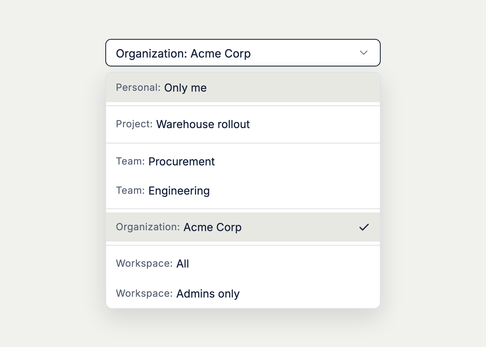
      </a>
    </td>
    <td valign="top">
      <h3>Ownership</h3>
      <p>Give threads, agents, skills, artifacts, and connections a home in a personal, project, team, organization, or workspace scope. Keep individual work in your personal space and organize shared work in the scope it belongs to.</p>
      <p><a href="assets/images/features/architecture-ownership.png">View screenshot</a></p>
    </td>
  </tr>
  <tr>
    <td width="600" valign="top">
      <a href="assets/images/features/architecture-authorization.png">
        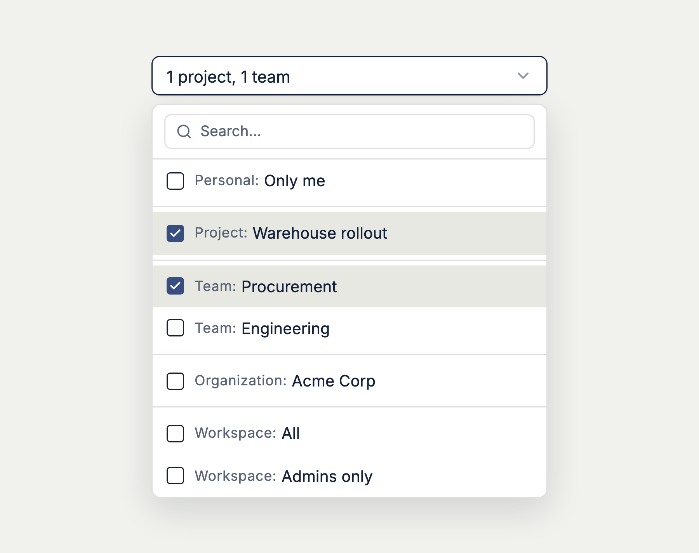
      </a>
    </td>
    <td valign="top">
      <h3>Authorization</h3>
      <p>Control access to agents, runs, connectors, connections, skills, artifacts, and workflows through resource-specific permissions and co-owners. Agents and integrations act within the authority granted to the relevant user or caller, so shared work respects those permissions.</p>
      <p><a href="assets/images/features/architecture-authorization.png">View screenshot</a></p>
    </td>
  </tr>
</table>

---

## Integration

Cinatra connects its workspace to the tools, agents, and interfaces people already use. External applications can call its capabilities, exchange events, or bring an assistant directly into their own interface. Access follows the authenticated user or integration’s permissions and the capabilities exposed by installed extensions.

- **Agent runtime portability:** Agents use the [Open Agent Specification (OAS)](https://github.com/oracle/agent-spec), allowing their definitions to run on any runtime that supports the Agent Spec features they use. Cinatra defaults to [WayFlow](https://github.com/oracle/wayflow), the reference implementation. Other options include LangGraph, CrewAI, and AutoGen through [Agent Spec runtime adapters](https://github.com/oracle/agent-spec#executing-agent-spec-configurations). Alternative runtimes integrate with Cinatra’s execution and lifecycle interfaces.
- **Multi-model support:** Cinatra is model agnostic: agents can use any LLM model through their runtime and provider integrations. The Cinatra core currently supports OpenAI and Anthropic.
- **MCP server:** Give any application access to Cinatra through its OAuth-secured Model Context Protocol (MCP) server, including AI clients such as Claude Desktop, Codex, and ChatGPT. Applications that implement an MCP client can discover available tools, work with permitted data, and invoke agents under the authenticated account’s permissions.
- **Agent-to-Agent protocol:** Use the Agent-to-Agent (A2A) protocol to call external agents or make published Cinatra agents available to other systems. Exchange tasks, follow progress, and receive results across application and Cinatra instance boundaries.
- **Webhooks:** Exchange events with connected applications through extension-supplied handlers. Cinatra verifies inbound signatures and tracks repeated deliveries, and sends signed outbound events with background retries and records of failed deliveries. Events can include published CMS content or mentions of external assistants.
- **Assistant stream:** Make a Cinatra assistant available outside the workspace through its AG-UI event stream. Third-party applications can display streamed replies and supported lifecycle interactions in an embedded widget, including requests for input and artifact reviews. WordPress and Drupal integrations bring this experience into the sites where people work.

## Architecture

Cinatra connects people and teams, applications, clients, and external agents through its application core and extension system. Agents combine memory, runtime, sandbox, and human-in-the-loop (HITL) capabilities, supported by background execution and persistent data. Shared permissions, scopes, and an audit trail carry through the work.

<a href="assets/architecture.svg">
  
</a>

- **Application core:** The Next.js application is organized as a monorepo of TypeScript domain packages. Each package owns its screens, capabilities, persistence, and background jobs, and communicates through public interfaces. Together they provide the workspace and lifecycle coordination.
- **Shared permissions, scopes & audit trail:** Personal, project, team, organization, and workspace scopes govern access to shared resources. Privileged actions record both allowed and denied outcomes in your database. Administrator access to user data requires a named, audited intervention rather than a standing grant.
- **Extension system:** Versioned packages supply assistants, artifacts, connectors, skills, and agents. Their declarations describe dependencies and capabilities, while the core manages access and registration. The Extensions Marketplace provides a shared catalog of these packages.
- **Agents:** Reusable definitions describe the work and its lifecycle steps. Agents bring together memory, a runtime, a sandbox, and HITL interactions to carry work through execution and human decisions.
- **Memory:** [Open Knowledge Format (OKF)](https://okf.md/) represents reusable knowledge as Markdown files with YAML metadata. Local memory bundles can synchronize into Cinatra’s shared records for permission-scoped recall across sessions and compatible agent tools.
- **Runtime:** Cinatra invokes the agent runtime over A2A to execute agent definitions. See [Integration](#integration) for supported runtimes, portability, and compatibility requirements.
- **Sandbox:** A broker and isolated sandbox workers run shell commands, scripts, and package installs for assistants, agents, and deterministic tasks. Access checks, resource quotas, and network policies govern execution, and command decisions are recorded for auditing.
- **HITL:** Human input and review use shared rendering components and typed AG-UI events over server-sent events (SSE), with durable replay through Redis. A2UI provides declarative interaction surfaces in chat and embedded assistants.
- **Background execution:** Server-side workers handle scheduling, jobs, retries, and notifications through BullMQ and Redis. Persisted run state supports pauses for human input and lets work continue independently of an open browser session.
- **Persistent data:** PostgreSQL stores workspace records, run state, revisions, and decisions; artifact files use dedicated blob storage. Graphiti and Neo4j maintain a derived knowledge index for retrieval across related records.

---

## Quick start

Requirements: Node.js 24 or newer, git, Docker with Compose, and about 6 GB of RAM.

```bash
npx @cinatra-ai/cinatra install
```

The installer checks prerequisites, prepares the checkout and configuration, starts local services, and installs dependencies. Running it again reconciles the existing instance. Add `--mode prod` for a production instance.

1. Open <http://localhost:3000> and register. The first account becomes the platform administrator.
2. Follow the setup wizard to configure a model provider and connect the applications you need.
3. Open an assistant, mention an agent by its handle, and describe the work. Respond to requests for input and review its artifacts as the run progresses.

For ongoing operation, install the CLI globally with `npm install -g @cinatra-ai/cinatra`, or replace `cinatra` in the commands below with `npx @cinatra-ai/cinatra`.

| Command | What it does |
|---|---|
| `cinatra instance start` / `stop` / `restart` | Run the instance |
| `cinatra update` | Update the checkout, dependencies, and database schema |
| `cinatra instance backup create` | Export a full backup bundle |
| `cinatra doctor` / `status` / `logs` | Diagnose and inspect the instance |

See the [Installation guide](https://docs.cinatra.ai/guides/hosting/installation/) and [Quickstart walkthrough](https://docs.cinatra.ai/guides/hosting/quickstart/) for details.

## Documentation

The documentation at [docs.cinatra.ai](https://docs.cinatra.ai) covers:

- **[User guides](https://docs.cinatra.ai/guides/user/):** Conversations, agents, skills, artifacts, reviews, and collaboration.
- **[Administration](https://docs.cinatra.ai/guides/admin/):** Extensions, permissions, providers, telemetry, and instance settings.
- **[Development](https://docs.cinatra.ai/guides/developer/):** Extension authoring, development workflows, and contributions to the core.
- **[Hosting](https://docs.cinatra.ai/guides/hosting/):** Installation, configuration, operation, and troubleshooting.
- **[Integrations](https://docs.cinatra.ai/integrations/):** Connections to applications such as WordPress, Drupal, Twenty, and Plane.
- **[References](https://docs.cinatra.ai/references/):** Platform architecture, MCP interfaces, design specifications, and terminology.
- **[Resources](https://docs.cinatra.ai/resources/):** Platform background and comparisons with other AI tools.

## Contributing

- **[Discussions](https://github.com/cinatra-ai/cinatra/discussions):** Ask questions, propose ideas, and share what you have built.
- **[Good first issues](https://github.com/cinatra-ai/cinatra/labels/good%20first%20issue):** Find a starting point for contributing to the core.
- **[Contribution guide](https://github.com/cinatra-ai/cinatra/blob/main/CONTRIBUTING.md):** Set up your development environment and follow the contribution workflow and [Code of Conduct](https://github.com/cinatra-ai/cinatra/blob/main/CODE_OF_CONDUCT.md).
- **[Extension development skills](https://github.com/cinatra-ai/claude-plugin):** Use Cinatra’s AI coding-agent skills for scaffolding, implementing, validating, and packaging extensions. Build an extension to add capabilities without changing the core.
