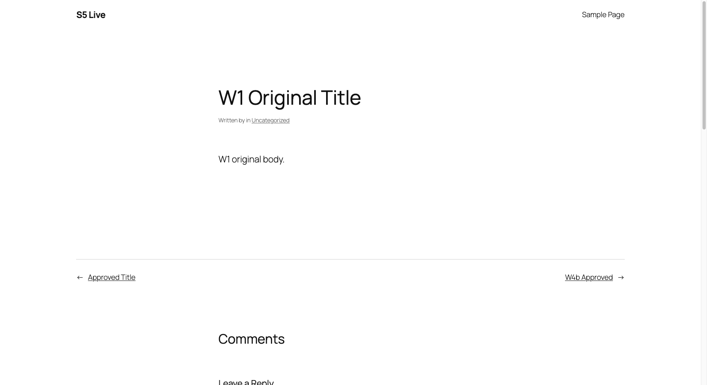
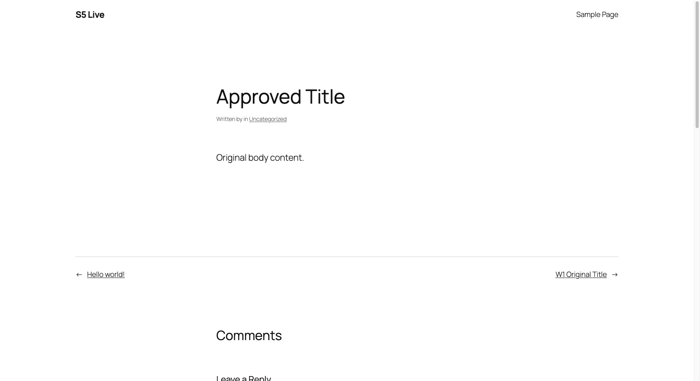
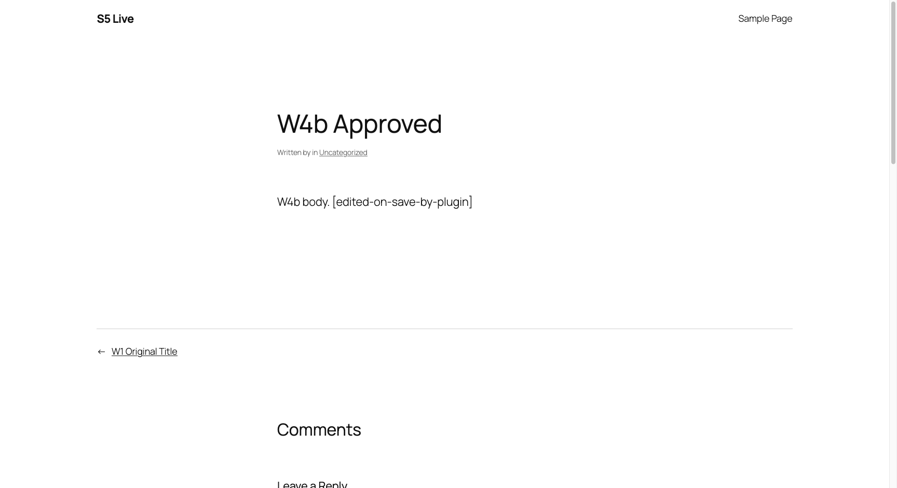

# cinatra#2043 S5 — host `@cinatra-ai/host:cms-review` capability: live end-to-end proof

The REAL merged connector staged-write trigger (`evaluateStagedContentWrite` @
wordpress-mcp-connector `9414cd8`) driven through the REAL published host
capability (`buildCmsReviewHostSeam` → the real core `captureCmsContentSnapshot` /
`resolveArtifactEffectDisposition` / `recordCmsApplyVerification`) against a REAL
Postgres (`s5live` on `127.0.0.1:5634`) and a REAL WordPress (docker, port 8790).
The review fence was ON (`CINATRA_LIFECYCLE_REVIEW_ORCHESTRATION=on`). Approval
was driven via the store engine (`commitReviewDecision`) — the CMS snapshot's
UI-decidability is the S6 / #2013 item, so this is the uncommitted real-engine
harness pattern prior lanes used.

Machine-readable store state: [`store-proof.json`](./store-proof.json).

## W1 — staged write captured + HELD; WordPress unchanged

A staged `wordpress_post_update` (propose `title`) through the connector trigger,
fence ON:

- decision `action = "hold"` — the effect is held; the write never reaches WordPress.
- ONE capture transaction wrote, in the same schema:
  - `objects` row `type = @cinatra-ai/objects:cms-content-snapshot` (the snapshot artifact);
  - a `representation` revision (the review/verification pin);
  - a `cms_snapshot_targets` apply binding — `operation_id`, `scope_manifest = {paths:["title"]}`, `connector_instance`, `resource_type=post`, `resource_id`, `base_remote_revision_ref` (the CAS anchor);
  - an `artifact_produced_outbox` event — `emitter=object_cms_snapshot_capture`, `destination_class=external_publish`, `status=pending`.
- **WordPress unchanged while pending** — the post still shows its original title.

## W4a — approve → connector applies → WordPress changes → read-back `verified`

- `sweepReviewOrchestration()` opened the review gate on the produced event; `commitReviewDecision(approve)` → `committed`.
- Re-drive of the trigger: disposition `approved` → decision `action = "apply"`.
- The apply landed on WordPress (title → `Approved Title`).
- Independent post-apply re-read → `recordApplyVerification` → **`verified`**; `artifact_verification_records.outcome = verified` (scope manifest `{paths:["title"]}`).

## W4b — site-plugin rewrite-on-save → read-back `drifted` + reopened gate on the run

A mu-plugin appends `[edited-on-save-by-plugin]` to `content` on `save_post`
(installed AFTER the post was created, so the drift is introduced only by the
apply-save). The proposal changed only `title` (scope `{title}`):

- After apply, the independent re-read sees `content` rewritten OUT OF SCOPE.
- `recordApplyVerification` → **`drifted`**, `outOfScope = ["content"]`; `artifact_verification_records.outcome = drifted`.
- The failed verification **reopened a bounded gate on the same run** — `store-proof.json` `W4b.gatesOnRun` shows two gates: the resolved `approve` gate + a pending `verify` reopen gate (the run-rail entry). The interactive run-rail UI for a CMS snapshot is the S6 / #2013 UI-decidability item.

