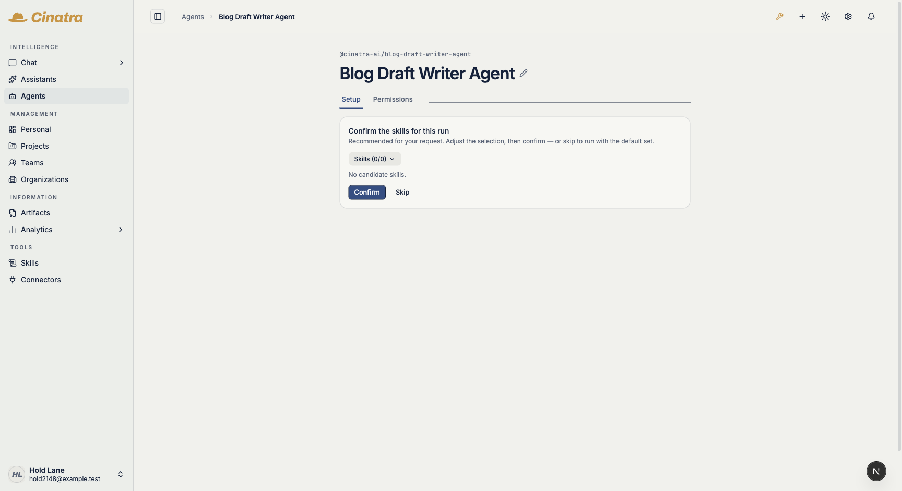
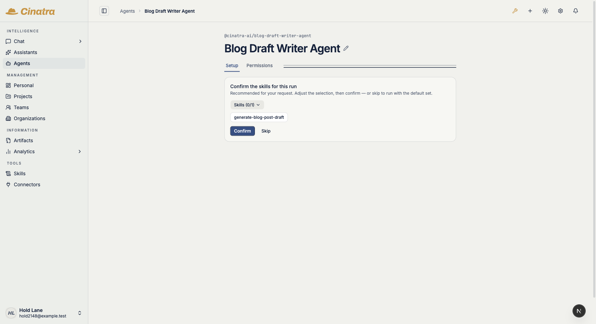
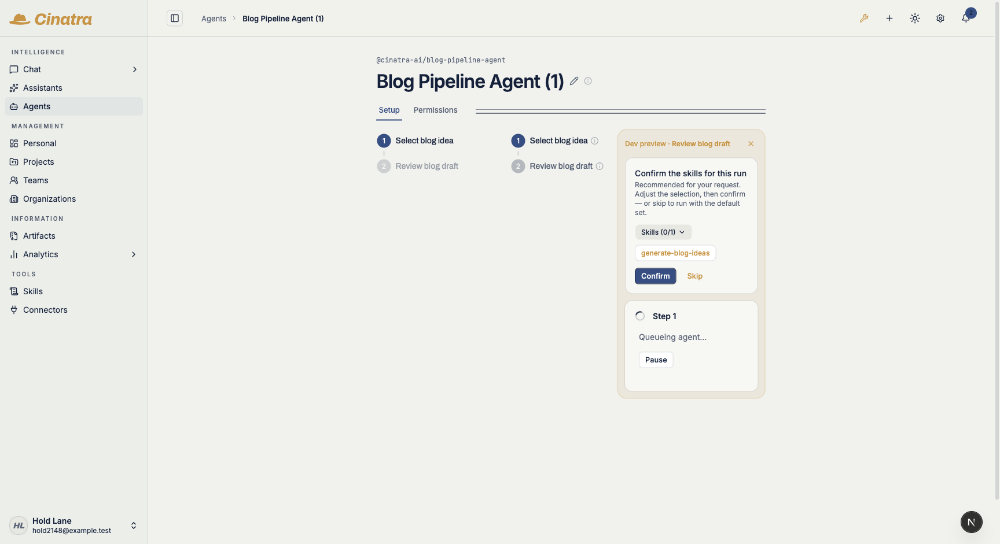
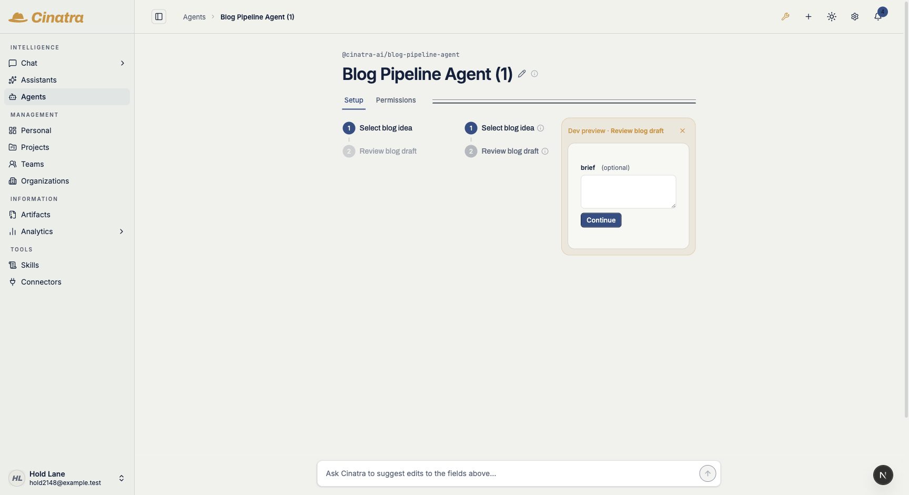

# cinatra#2148 — recommendation-hold consistency: live walk

Live walk on this lane's own stack (own Postgres DB + own dev port + own queue),
default-on (no env var set — `CINATRA_LIFECYCLE_RECOMMENDATION_CHIP_ROW` was
left unset for every step below).

## Fixture

One org-scoped `custom_skill_assignments` row per agent — the exact class the
actor-free resolve dropped:

| skill | agent | owner_type | owner |
|---|---|---|---|
| `@cinatra-ai/blog-skills:generate-blog-post-draft` | `@cinatra-ai/blog-draft-writer-agent` | `organization` | the workspace's default org |
| `@cinatra-ai/blog-skills:generate-blog-ideas` | `@cinatra-ai/blog-pipeline-agent` | `organization` | the workspace's default org |

There are no `skill_matches` rows on this stack, so the org assignment is the
SOLE source of each candidate — which is what makes the A/B below decisive.

## A. Finding 1 — an org-assigned skill reaches the chip row

Same run, same fixture, only the code differs.

**BEFORE** (`origin/main`): `Skills (0/0) — No candidate skills.`
The org assignment exists but the actor-free resolve never reads it.

**AFTER** (this branch): `Skills (0/1) — generate-blog-post-draft`.

A third control (assignment deleted, fixed code) also renders
`No candidate skills.` — so the chip is attributable to the org assignment
being read, not to any other candidate tier.

## B. Finding 2 — a Dev-Stepper preview run parks, and confirm releases it

Two dev-preview clicks on the SAME step, in the same session:

| | candidates | run status after the click | park |
|---|---|---|---|
| click 1 (no org assignment yet) | none | `pending_approval` — dispatched, exactly as before | none |
| click 2 (org assignment present) | 1 | `pending_input` — **parked** | `recommendation`, `parked` |

The parked preview renders the shared chip row inside the Dev-preview card:

`Confirm` releases the park and the run dispatches — the park row goes
`parked → released` (resolved) and the run advances `pending_input →
pending_approval` (it dispatched, executed, and reached its HITL gate):

## Not live-walked

Finding 3 (the `immediate` trigger) is pinned by unit tests that provably fail
against `origin/main` plus the real-store park/release integration test; the
immediate-trigger surface was not reachable in this walk without first
dispatching the run under test.
