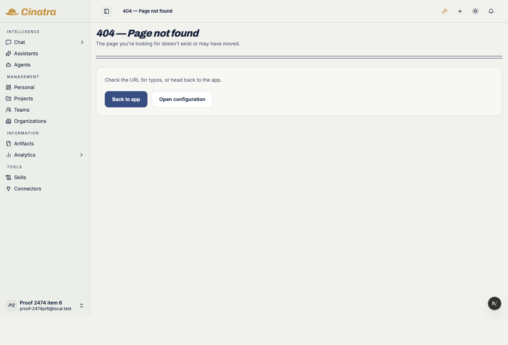
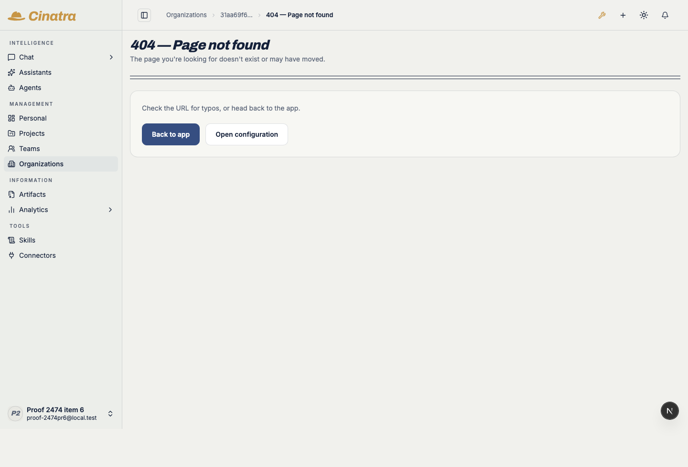
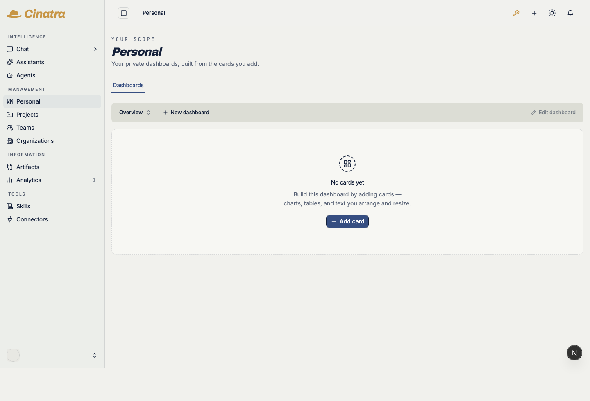
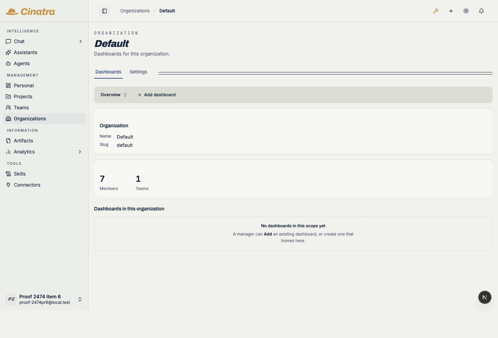
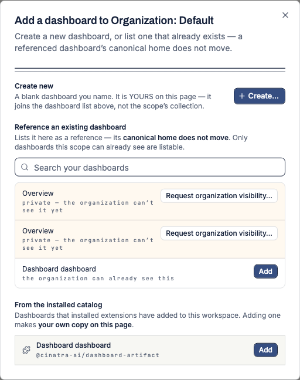
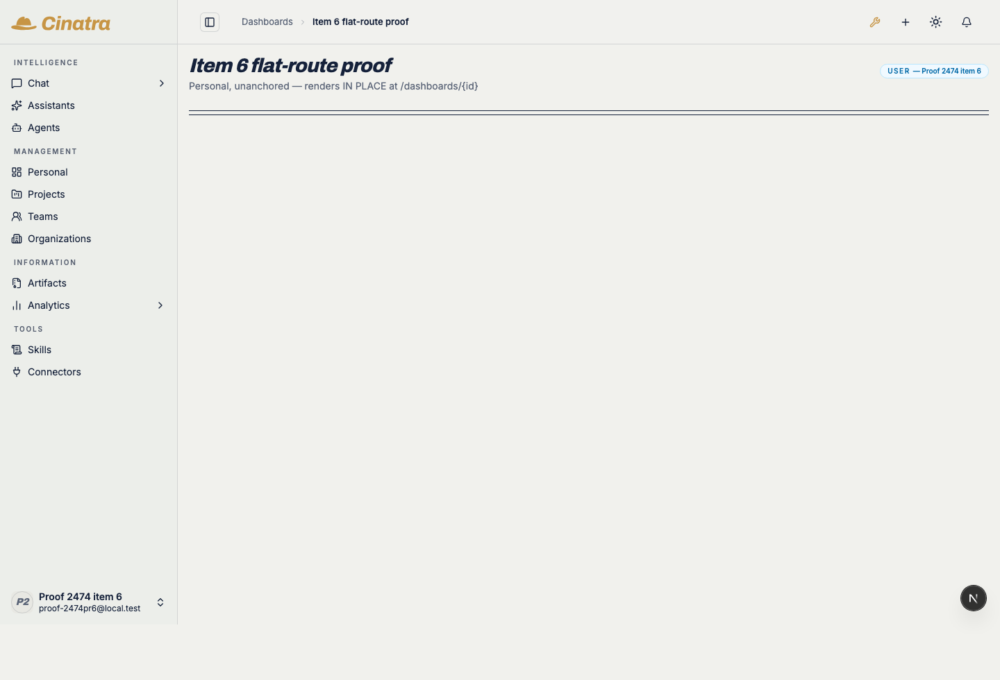
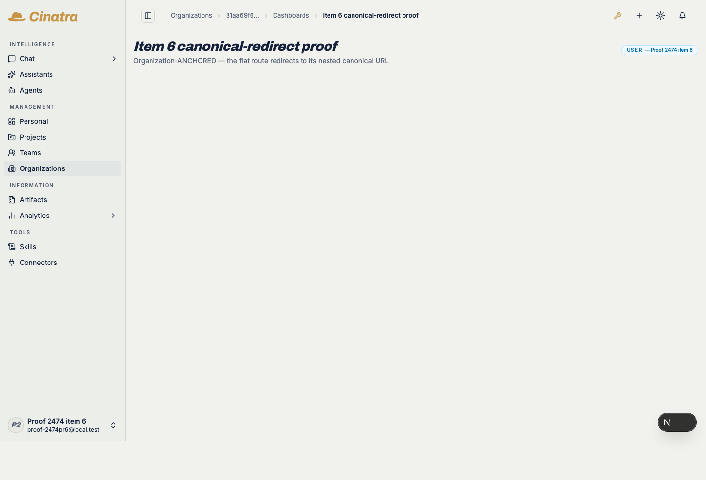
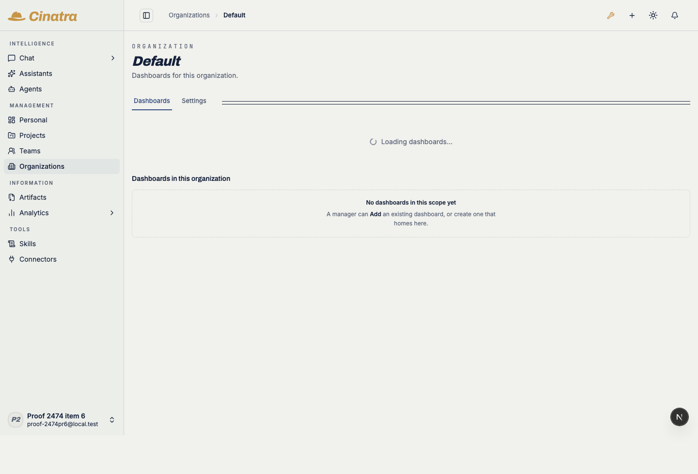
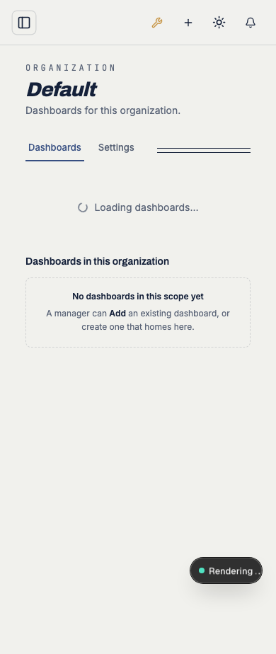

# cinatra#2474 item 6 — evidence

Work item **6 of six** — the final slice: *"ensure the legacy bare `/dashboards`
is fully gone — not a route, no residual code left (follow-through on #2058)."*

**Retirement semantics: DELETION.** Not a redirect, not a tombstone, no shim.
The issue leaves nothing open here — #2058's owner ruling is quoted verbatim on
that issue (*"retire without redirect / backward compatibility"*) and #2474's own
constraint repeats it (*"No redirects and no backward-compat shims — remove
retired routes/code outright"*). Round 0 with Codex re-read both against the code
and agreed: there is no defensible reading under which item 6 also retires the
per-dashboard **detail** routes.

The **route** half was already done by #2058, which deleted
`src/app/dashboards/page.tsx`. This slice is the **"no residual code left"** half
— plus an end-state lock that pins the whole retirement now that #2474 is
complete.

---

## What ran, and where

Every leg ran on **a lane host** (`<lane-host>`, macOS x86_64) against
`lane/2474-pr6-cleanup` on a real dev boot — real Postgres, a real Better Auth
session, real Chromium. **No credential or secret was placed on that host**: the
proof account's password was generated locally there with `crypto.randomBytes`
and never printed.

| Tier | Result |
|---|---|
| `pnpm typecheck` (whole repo, tsgo, extensions materialized) | **0 errors** |
| root vitest over `src/app/dashboards`, `src/components/dashboards`, `src/lib/dashboards`, `src/app/__tests__` | **33 files / 406 tests** pass |
| `eslint` on every touched file | **0 errors** |
| `pnpm route-graph` + `route-graph-ratchet` | **OK — no tracked route exceeds its baseline** |
| live battery (below) | **14 / 14 PASS**, 0 uncaught page errors |

`knip` reports the repo's pre-existing 56 unused files (it is deliberately
non-blocking in CI, `knip-report.yml`); the relocated action module is **not**
among them — knip sees it through its two live importers.

---

## The live battery — 14/14

Raw output: [`probe-results.json`](./probe-results.json). Every HTTP status is
**probed from the navigation response**, never inferred from a screenshot.

### A · the retirement itself

| id | assertion | result |
|---|---|---|
| A1 | **AUTHENTICATED** `GET /dashboards` → **404** — the directory page is deleted | PASS |
| A2 | no redirect and no tombstone — the URL stays `/dashboards` | PASS |
| A3 | the 404 is the app's own not-found surface, not a dashboards list | PASS |

The sidebar in that capture is the whole point: there is no Dashboards entry to
return to. Dashboards live under **Artifacts** and on each scope's Dashboards
tab.

*Honest scope note:* this walk is a **dev** boot, where the auth middleware
answers a **sessionless** `/dashboards` with a 307 to `/sign-in` before the
router ever resolves the path. #2058's own prod-standalone e2e
(`tests/e2e/dashboards/directory-retired-2058.spec.ts`) is the proof for the
sessionless arm, and it is unchanged by this slice. The claim item 6's acceptance
criterion makes — the **authenticated** 404 — is what A1–A3 prove here.

### B · the PR2 collection routes stay gone

| id | assertion | result |
|---|---|---|
| B1 | `/organizations/{id}/dashboards` still **404**s — PR2's deletion holds | PASS |

### C · the surviving scope landings are untouched

| id | assertion | result |
|---|---|---|
| C-personal | `/personal` — Dashboards tab present and active, **Dashboards-only** (no Settings pane, #1904) | PASS |
| C-organization | `/organizations/{id}` — `Dashboards \| Settings` tablist, Dashboards active | PASS |
| C-*-noretired | neither landing links at the retired `/dashboards` root | PASS |

| personal | organization |
|---|---|
|  |  |
|  |  |

### D · the relocated server-action module, exercised across the wire

This slice moves `scope-dashboards-actions.ts` out of `src/app/dashboards/` (the
retired page's folder) to `src/components/dashboards/`, beside the two binders
that are its only consumers. A `"use server"` module's **action ids derive from
its module path**, so the honest proof is not a unit test — it is a real browser
invoking one.

| id | assertion | result |
|---|---|---|
| D1 | the org landing still mounts the collection panel (its wiring imports the moved module) | PASS |
| D2 | the Add-dashboard popup opens and its Reference section **round-trips `scopeListCandidatesAction`** — no stale/missing action id, no server-action console error | PASS |

Those candidate rows, their per-row disposition (`Add` vs *"Request organization
visibility…"*), and the installed-catalog section below them are all data the
relocated action returned over the wire.

### E · the preserved detail routes, BOTH modes

The one thing "bare `/dashboards` fully removed" must not be over-read into.
`canonicalDashboardPath` still mints `/dashboards/{id}` for personal / workspace
/ project / legacy-unanchored rows.

| id | assertion | result |
|---|---|---|
| E1 | a personal/unanchored row **renders in place** at `/dashboards/{id}` (mode 1) | PASS |
| E2 | an organization-**anchored** row still access-check-**redirects** to its nested canonical URL (mode 2) | PASS |

| mode 1 — renders in place | mode 2 — redirects to canonical |
|---|---|
|  |  |

In the mode-2 capture the breadcrumb's intermediate **Dashboards** crumb is a
plain label, not a link — `isPagelessContainerCrumb` in
`src/lib/breadcrumb-trail.ts` handles that since PR2 deleted the collection
index. That branch is live, required code and this slice deliberately does **not**
touch it.

### F/G · theme, viewport, cleanliness

| id | assertion | result |
|---|---|---|
| F1 | dark — `/dashboards` still 404s | PASS |
| G1 | no uncaught page errors across the whole walk | PASS |

| dark 404 | dark landing | 390px landing |
|---|---|---|
|  |  |  |

---

## Fixtures

Two dashboard rows were seeded directly for the E leg, exactly as #2058's own
e2e seeds its two modes — the assertions under test are **routing**, so the rows
only need the shape the router reads:

- `proof-2474pr6-flat` — `owner_level=user`, no entity anchor → mode 1.
- `proof-2474pr6-anchored` — `entity_type=organization` → mode 2.

The first attempt at E2 used a pre-existing **org-OWNED but not org-ANCHORED**
row and correctly did **not** redirect; the anchored fixture is what mode 2
actually requires. Recorded because it is the kind of near-miss that would
otherwise look like a passing proof of the wrong thing.

## What this slice deliberately did NOT change

- **The flat and nested detail routes** — live product surface (pinned above).
- **`isPagelessContainerCrumb`** — required so the intermediate crumb does not
  link to a 404.
- **`filterReadableDashboards`** in `src/lib/dashboards/authz.ts` — it lost its
  product caller with the directory page, and is kept **deliberately**, reviewed
  in Codex round 1 (which withdrew its round-0 "remove"): it is the only callable
  that composes what production composes — the private `toDashboardActor` role
  normalization, the package owner gate, the resolved project grants — and it is
  the subject of the #1898/#1988 ACL agreement proofs. Deleting it would force
  those proofs to hand-roll a copy of that normalization, which could drift and
  let the agreement pass against a mapping production no longer performs. Its
  header now says so instead of leaving it looking overlooked.
- **The historical decision records** in `docs/internals/decisions/` that mention
  `/dashboards` — rewriting a dated audit record would falsify it.
