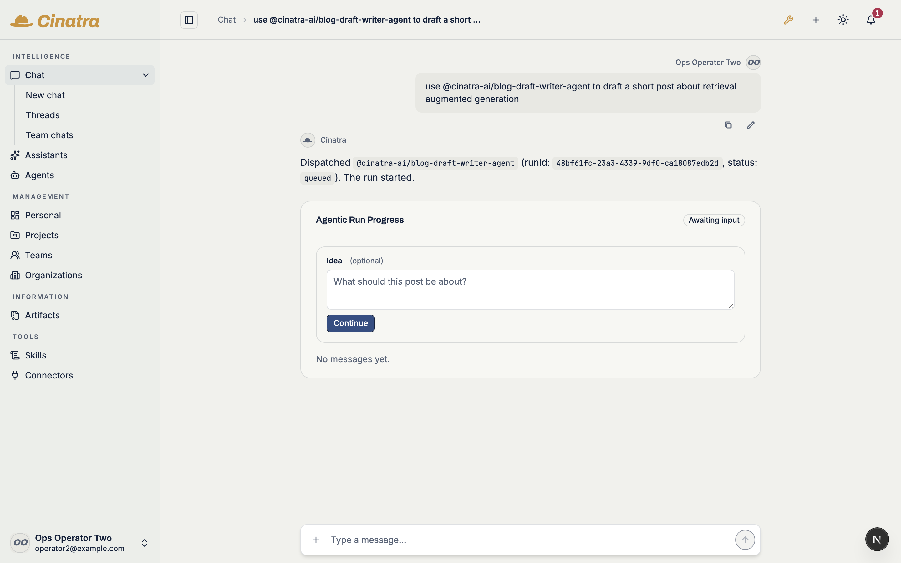
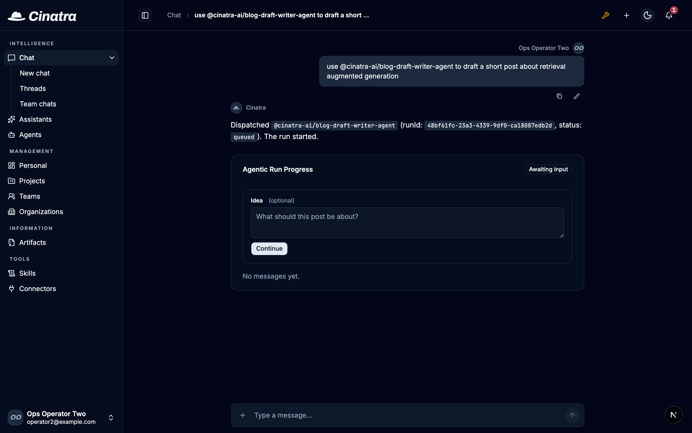
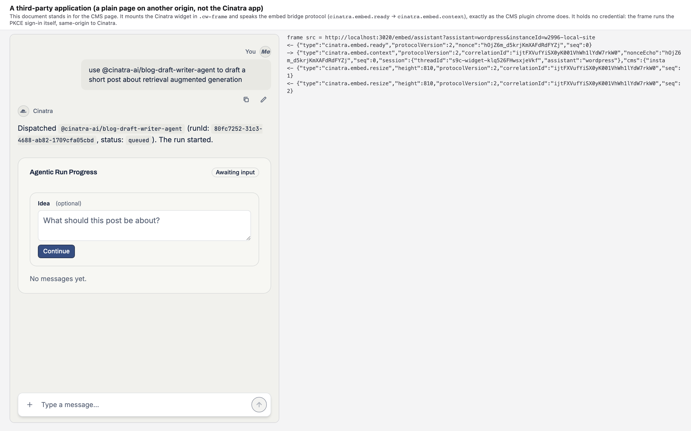
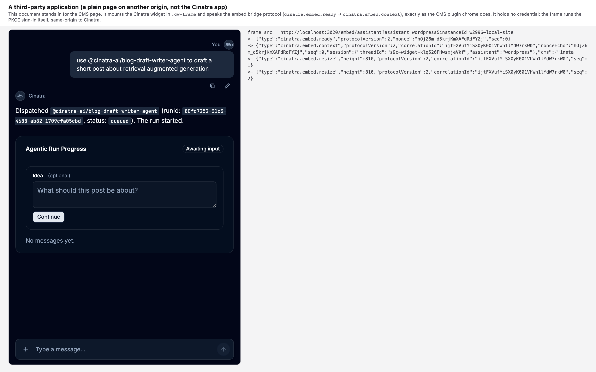
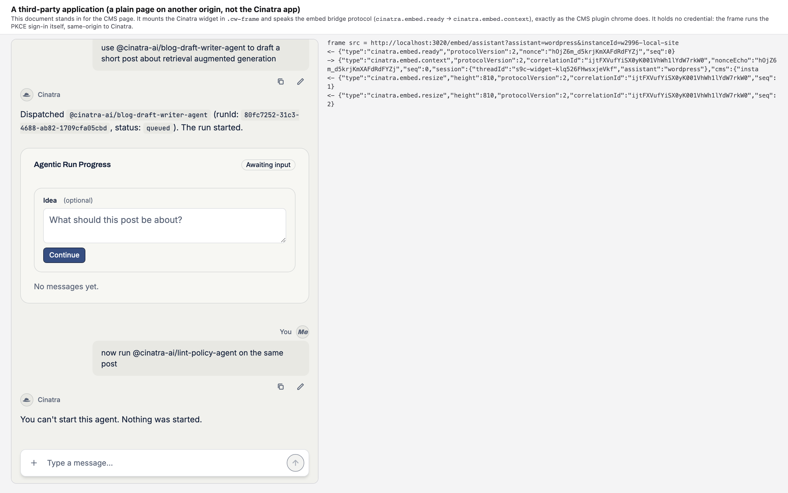
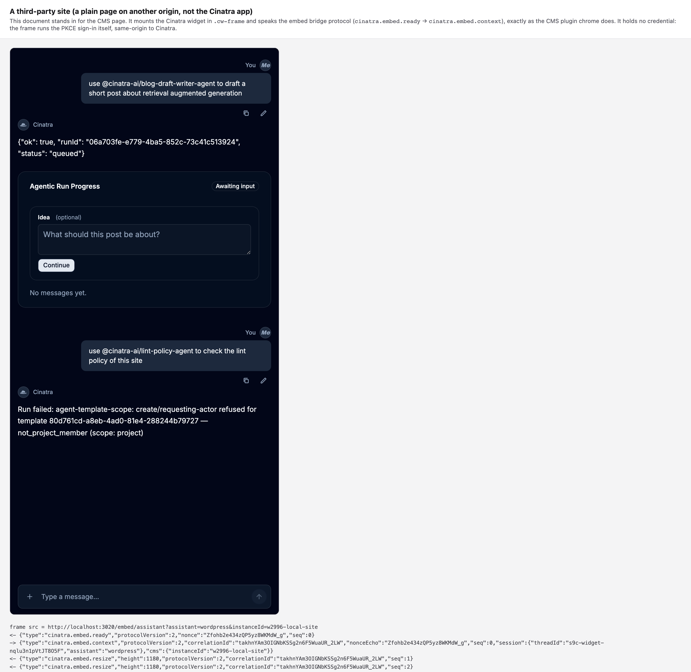

# cinatra#2935 (lifecycle-b W5d) — the picture leg

Head under proof: `a8e81c9b6ffa26e9199ba9252124ac745417ae4b`, plus this evidence
commit.

**The two chat captures were re-taken on this head.** The four third-party
application captures — the two starts and the two refusals — **stand
byte-identical**: nothing on this head changes the door they were taken through,
and their bytes match both the previous evidence commit
`a9ac9b3650a42c6a2c049fe4950aeb57c8be063e` and the SHA-256 table in
`capture-records.md`.

**Why the chat pair was owed again.** The pair before it was shot on
`39494751b81e9105b79a84be6759c8f9e49c5104`, where the chat host answered a start
in words of its own. Two things changed after it: `agent_run`'s description now
carries ONE reply rule and no polling mandate (`RUN_START_REPLY_RULE`,
`packages/agents/src/run-status.ts:478`), and the pinned assistant skill
`@cinatra-ai/chat-assistant-core-skill` was re-pinned to
`ec584587d06dc33ca904dff91e6e369a4a847def`, whose `chat-run-polling.md` now opens
*"Step 6.1 — After a start, the reply is the platform's message"*. **This pair is
what the two carriers changed.** Every capture below was viewed before it was
recorded.

## The runtime, said first

The branch's own dev server (Next.js, Turbopack), `CINATRA_RUNTIME_MODE=development`,
on the round's own database with the branch's own extension tree (112/112 packages
at their lock SHAs, the assistant skill among them at its re-pinned SHA). **A real
provider key and a real model**: the organization's own configured provider and
model — `openai` / `gpt-5.5`. The key was never written to disk on the capture
machine and never printed: it was typed into the product's own `/setup/model`
form out of the operator's secret manager, and the app sealed it itself.

**Verified on the instance before the pictured turn**, because the whole point of
this pair is which text the model was handed: the lock pins
`@cinatra-ai/chat-assistant-core-skill` at
`ec584587d06dc33ca904dff91e6e369a4a847def`, `sync-dev-extensions --pinned` reports
`112/112` and re-pins `b1b51c8c5af3 → ec584587d06d`, the package on disk reads
`ec584587d06d` at `git rev-parse`, and its `chat-run-polling.md` first line is
`### Step 6.1 — After a start, the reply is the platform's message`.

**The signed-in person is an ordinary member.** `member` in `public.member` for
the one organization, **no** row in `cinatra.role_grant`, **no** row in
`cinatra.project_access`, **no** row in `cinatra.project_co_owners`.

**Two agents, one they may start and one they may not.**

| | package | install scope |
|---|---|---|
| may start | `@cinatra-ai/blog-draft-writer-agent` | `owner_level='organization'`, the person's own org |
| may **not** start | `@cinatra-ai/lint-policy-agent` | `owner_level='project'` onto a project owned by **another user**, on which the person holds no grant |

**The third-party application is genuinely cross-site.** The app answers on
`localhost`; the page the widget is embedded in is served from `127.0.0.1`.
Different origins **and** different registrable domains, so the app's
`SameSite=Lax` session cookie cannot ride the embed frame. The widget instance
and its connect-site were written by the two **shipped** writers the CMS OAuth
exchange itself calls (`writeConnectorConfigToDatabase`,
`upsertConnectSiteAndMintCredential`); `deriveFrameBinding` closes (`ok: true`,
site `423e66c5…`, credential version 1); and the person signed in through the
**hosted flow the frame itself opens** — nothing was injected into the frame's
context. The bridge log beside the frame in every widget capture is the real
`cinatra.embed.ready` → `cinatra.embed.context` handshake, with the frame's own
`cinatra.embed.resize` answers after it.

**The waits are the two the recipe names, never a fixed sleep.** Each leg waits
first for the assistant's tool call to settle (the live-status line gone off the
turn), then for the run card to attach under the anchors the hosts publish —
`[data-agent-run-slot]` wrapping `[data-inline-run-card]` — and records both
timestamps.

**The window.** 1440x900 at device scale 2, whole window, both themes.

## The drawing this is graded against

`specs/app-lifecycle-cards.html` at `458fb7ffce6cf4ab6a2c60d3ff47198135d8ea2f`,
**§I The conversation**, **§IX Where each card appears** and **§XI The relayed
refusal**, rendered headless at 1440 wide and read as pixels.

**The drawing the chat pair is graded against did not move.** Against
`fe2182547d4a` — the commit the standing captures were graded on — **§I and §IX
are byte-identical** (each section's markup hashes equal across the two commits).
What differs elsewhere on the page is a rename of *prompt window* to *chat box*
in §II/§IV/§XI, §II's own expansion, and the masthead version `v0.5.0 → v0.6.0`.
None of that touches a clause graded here.

**§I** — the thread is the frame; two turn shapes: a person's turn right-aligned
with name and initials above, a filled bubble that hugs its text and the quiet
copy/edit marks beneath; the assistant's turn left-aligned with **no bubble**,
the Cinatra mark and name, then the content on the thread ground filling the
column, where **a card takes that content slot at the column's full width,
exactly where prose would otherwise sit**; and **exactly one primary input per
conversation** — the chat box — with any field a card carries drawn subordinate
to it.

**§IX** — four hosts, one card set, the **same card** wherever it appears; only
the **frame** changes. Its reader matrix ends **"No card at all"** for a reader
who may not read the target, on every host.

**§XI** — a refusal is the platform's own sentence, said back: "never softened,
never re-worded, and never replaced by an act"; and a refused act "settles
nothing: no card moves, no gate resolves, no schedule is armed."

**The plan's own words**, added to every line clause below: the assistant
"reports what came back and adds nothing".

## The six captures

| capture | requires | shows | verdict |
|---|---|---|---|
| `chat__assistant-started-the-agent__light.png` | §I turn shapes, the card in the content slot at full width, one primary input; the line is the platform's report sentence, said back exactly, nothing added | every §I clause holds; the line is the platform's `message` **word for word**, and the card sits beneath it | **PASS** |
| `chat__assistant-started-the-agent__dark.png` | the same, in the app's dark palette | the same composition and the same sentence, re-toned | **PASS** |
| `site-widget__assistant-started-the-agent__light.png` | §IX same card, frame changed; §I shapes inside the frame; the platform's report sentence | the sentence word for word, then the same card | **PASS** |
| `site-widget__assistant-started-the-agent__dark.png` | the same, in dark | the same, dark | **PASS** |
| `site-widget__refused__may-not-start__light.png` | §XI's sentence exactly, **no card** for the refused start, no second run row | the sentence exactly; one card, the first run's; no row written | **PASS** |
| `site-widget__refused__may-not-start__dark.png` | the same, in dark | the same, dark | **PASS** |

### The chat host

**Requires** (§I) — the card arrives in a conversation, after what the person
asked; the person's turn right-aligned with name and initials above, a filled
bubble that hugs its text, the quiet copy and edit marks beneath; the assistant's
turn left-aligned with **no bubble**, the Cinatra mark and name; the card in that
content slot at the column's **full width**; **exactly one primary input**. And
the plan's words — the assistant "reports what came back and adds nothing": the
line **is the platform's report sentence**, said back exactly, never a JSON
literal and never the model's own prose.

**Shows** — the thread bar `Chat › use @cinatra-ai/blog-draft-writer-agent to
draft a short ...`; `Ops Operator Two` + `OO` over a right-aligned filled bubble
holding `use @cinatra-ai/blog-draft-writer-agent to draft a short post about
retrieval augmented generation` verbatim, the quiet copy and pencil marks
beneath; `Cinatra` mark and name, **no bubble**; then, on the thread ground and
word for word:

> Dispatched `@cinatra-ai/blog-draft-writer-agent` (runId: `48bf61fc-23a3-4339-9df0-ca18087edb2d`, status: `queued`). The run started.

and **beneath it** the run card — `Agentic Run Progress`, the `Awaiting input`
pill, `Idea (optional)` over its own field, `Continue`, `No messages yet.` —
filling the content slot at the column's full width; one composer at the foot
(`Type a message...`).

That sentence is the platform's own. Read out of the stored turn's `agent_run`
tool result, `message` is byte-identical to the text part the assistant wrote and
to the line on screen (`RUN-READBACK.md`: equal sha256; the on-screen line is the
same string with its backticks rendered as code spans). Nothing was added to it.

**Verdict — PASS**, on every §I clause and on the plan's line rule (deviations
D1, D6, D7, D8). Sent 01:51:51.084Z · tool call settled 01:52:09.866Z · card
attached 01:52:15.735Z · run `48bf61fc-23a3-4339-9df0-ca18087edb2d`.

**Requires** — the same regions and shapes in the app's dark palette.
**Shows** — the same composition on a dark ground: the dark bubble, the card's
panel and `Awaiting input` pill re-toned, the theme control drawn as the moon;
the same sentence, in the same place, above the same card; nothing added, nothing
dropped. Measured identical to the light capture on every anchor.
**Verdict — PASS** (D1, D5, D6, D7, D8).

### The third-party application

**Requires** (§IX) — the **same card** on the site-widget host, only the **frame**
changed; §I's two turn shapes and one primary input inside that frame; the
assistant's line **is the platform's report sentence**.

**Shows** — the third-party page's own header and, beside the frame, the live
bridge log (`cinatra.embed.ready` → `cinatra.embed.context` → two
`cinatra.embed.resize`); inside the panel: `You` + `Me` over a right-aligned
filled bubble with the same sentence, copy and pencil beneath; `Cinatra` mark and
name, no bubble; then the platform's sentence, word for word —

> Dispatched `@cinatra-ai/blog-draft-writer-agent` (runId:
> `80fc7252-31c3-4688-ab82-1709cfa05cbd`, status: `queued`). The run started.

— and **beneath it** the same card: `Agentic Run Progress`, `Awaiting input`,
`Idea (optional)`, `Continue`, `No messages yet.`, at the panel's full width; one
composer at the foot.

**Verdict — PASS** (D1, D5 for the dark twin, D6). Sent 19:56:23.188Z · settled
19:56:41.254Z · card attached 19:56:41.263Z · run
`80fc7252-31c3-4688-ab82-1709cfa05cbd`.

**Requires** — the same, in dark.
**Shows** — the same panel, the same sentence and the same card in dark, inside
the third-party page's own unchanged chrome.
**Verdict — PASS** (D1, D5, D6).

### The refusal

**Requires** (§XI, §IX) — the refusal is the platform's own sentence, relayed
unchanged and in plain words; **no card may appear** for the refused start (§IX's
reader matrix: *No card at all*); and nothing may settle — no run row written.

**Shows** — the first run's card unmoved above; a second person's turn naming
`@cinatra-ai/lint-policy-agent`; then the assistant's answer, alone on the thread
ground:

> You can't start this agent. Nothing was started.

Exactly the platform's sentence, with no template id, no machine reason and no
scope level in it. **No second card** — measured, both card anchors list exactly
one id, the first run's — and **no row was written** for the refused start
(`agent_runs` for that template: 0 since the round began).

**Verdict — PASS.** Sent 19:56:51.910Z · settled 19:57:07.962Z.

**Requires** — the same, in dark.
**Shows** — the same two turns, the same single card and the same sentence, in dark.
**Verdict — PASS** (D5).

## What these pictures found

**Both hosts now say the platform's sentence.** The half of D2 that the standing
set left open is closed, and this pair is the picture of it closing. On the
previous head the chat turn ran `agent_run` → `skill_file_read` → `agent_run_get`
and answered from the poll in words of its own. On this head the stored turn is
`agent_run` → the card part → the text, and the text IS the platform's `message`:

| looked for in the stored turn | found |
|---|---|
| `agent_run` tool call and its result | present |
| the card part (`dataParts`, `kind: agent_run`) | present, naming the run |
| the assistant's text | the platform's `message`, byte-identical |
| `skill_file_read` of the polling reference | **absent** |
| `agent_run_get` | **absent** |
| a sentence of the model's own about the run's progress | **absent** |

`RUN-READBACK.md` carries the parts, the tool result verbatim and the three-way
string comparison. The two carriers that changed are both in the picture: the
in-tree reply rule reached the model through `agent_run`'s description, and the
re-pinned skill's `chat-run-polling.md` no longer orders a poll after a start —
both verified on the instance before the turn was driven, not assumed.

**What the composition change is.** On the standing capture the card sat ABOVE
the assistant's line; here the line comes first and the card sits beneath it,
which is the order §I's own worked example draws. That was D4, and it closes with
the line clause — the same turn shape produced both.

## Deviations

**D1 — the anchors an earlier recipe named are not the anchors either host
publishes**, unchanged on this head and measured 0 on both re-taken captures.
`[data-run-card]` is published in exactly one component,
`packages/chat/src/renderer/ag-ui-interactive.tsx:352` — the decoupled AG-UI
renderer, which neither host mounted here. `[data-inline-agent-run-card]` is
published by **no component at all**: it appears only as a selector literal in
`src/lib/lifecycle/held-turn-card-contract.ts:404`. Both hosts draw the card under
`[data-agent-run-slot]` (`packages/chat/src/chat-messages-view.tsx:271`) wrapping
`[data-inline-run-card]` (`packages/chat/src/inline-agent-run-card.tsx:345`).

**D2 — CLOSED.** The two hosts now answer alike: each says the platform's own
sentence back, word for word. The earlier half (a JSON envelope read out to a
person inside a third-party application) was closed by the standing widget
captures; the remaining half — chat answering in its own words — is closed by the
pair above.

**D3 — the relayed refusal is plain words**, and this is the deviation an earlier
set found being closed: `You can't start this agent. Nothing was started.`
carries no template id, no machine reason and no scope level. Unchanged on this
head; the refusal captures stand.

**D4 — CLOSED for the chat host.** The card no longer sits above the assistant's
line: the line is drawn first and the card beneath it, which is §I's own order.
Both hosts now draw it that way.

**D5 — the drawing has one palette.** Re-measured for this pair at
`458fb7ffce6cf4ab6a2c60d3ff47198135d8ea2f`: rendered with the dark colour scheme,
§I and §IX each produce a **byte-identical** PNG to their light render (equal
sha256), so the dark capture is graded against structure, not against colours the
page does not draw.

**D6 — §IX's matrices do not enumerate the agent-run card** (they cover Review,
Verification, Recommendation, Schedule proposal). Its interior is therefore graded
against §I's slot rule and §IX's constancy rule, not against a drawn interior.

**D7 — the run card's own field is not drawn subordinate to the chat box.** §I
takes the weight off a card's field by removing the enclosing box, the raised
ground and the send affordance. The setup gate inside this card keeps an enclosing
box and a filled primary `Continue`, so a conversation carrying this card shows
two places that read as somewhere to type. The chat box is still the one
*conversation* input (measured: one composer on each capture); the weighting rule
is what is not applied. Unchanged by this re-shoot.

**D8 — NEW, and it is a deviation of the capture, not of the product: the dev
server's own indicator is in the frame.** Both re-taken captures carry the
Next.js dev-tools badge — the small dark circle at the bottom-right corner. It is
injected by the dev server (`devIndicators: { position: "bottom-right" }`,
`next.config.ts:148`, unchanged between this head and the head the standing
captures were taken on) and it is not product chrome. The four standing captures
do not carry it, so the set is not uniform in this one respect. It covers no
region §I fixes and no clause graded above; it was left in rather than removed,
because removing it would mean either editing the head under proof or retouching
a picture. Named rather than hidden.

## How to re-take these

Both drivers wait on the tool call's settle and then on the card's attach under
`[data-agent-run-slot]` / `[data-inline-run-card]`; neither uses a fixed sleep for
either. The widget leg drives ONE conversation for both legs — the start, then the
refused start — so the "no second card" reading is made in the same panel that
already carries one.
