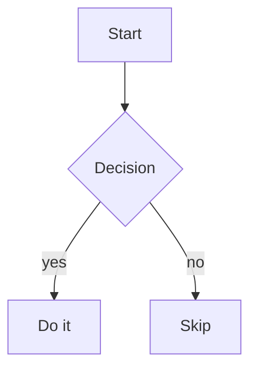

## Chart and mermaid embeds

A prose intro before a valid bar chart:

[chart:{"version":1,"type":"bar","title":"Revenue by region","x":["EMEA","APAC"],"series":[{"name":"Q1","data":[1200,980]}]}]

A mermaid diagram:

An invalid chart embed (schema-rejected, rendered as an error, not crashing):

[chart:{"version":1,"type":"not-a-chart-type","series":"nope"}]

A trailing paragraph after the embeds.
